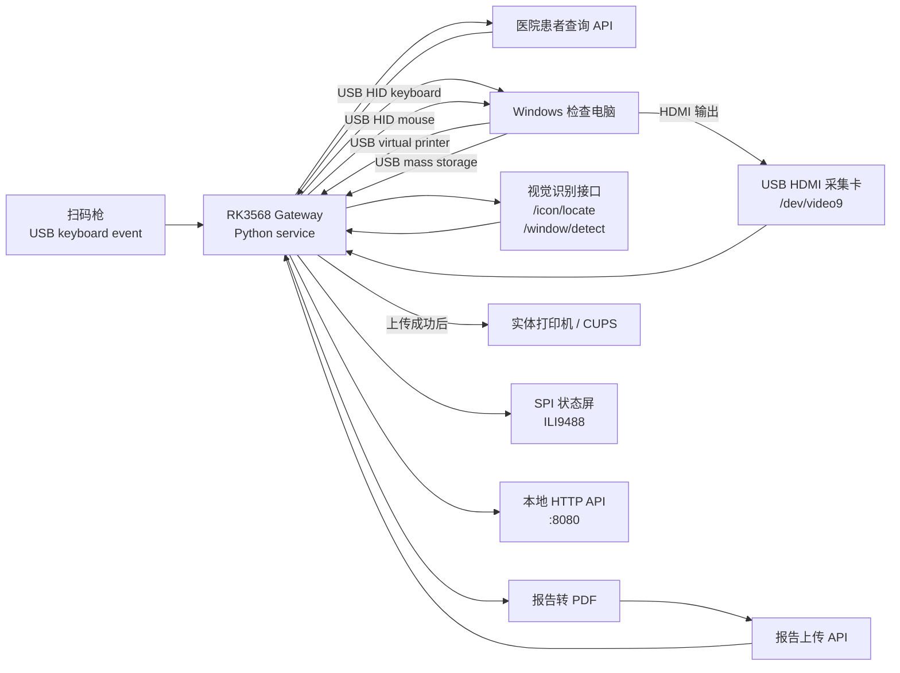
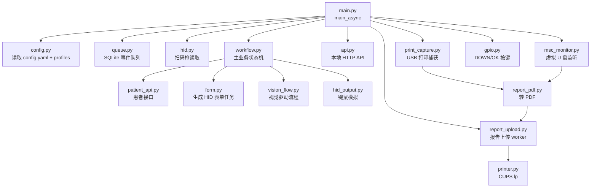
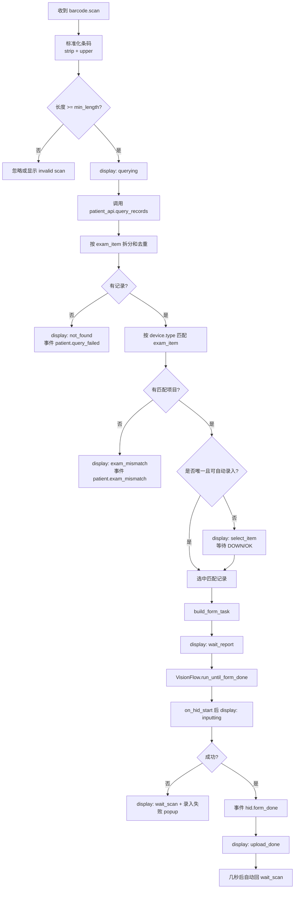
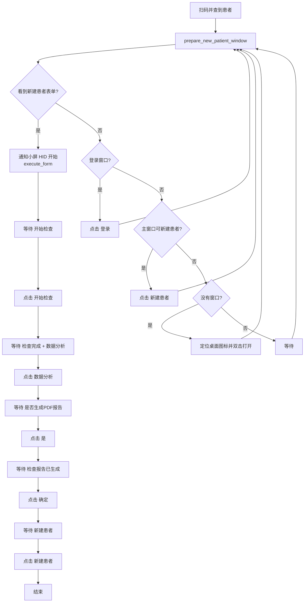
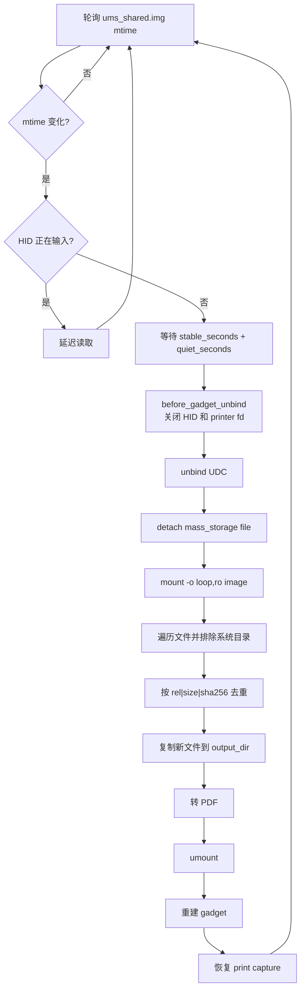
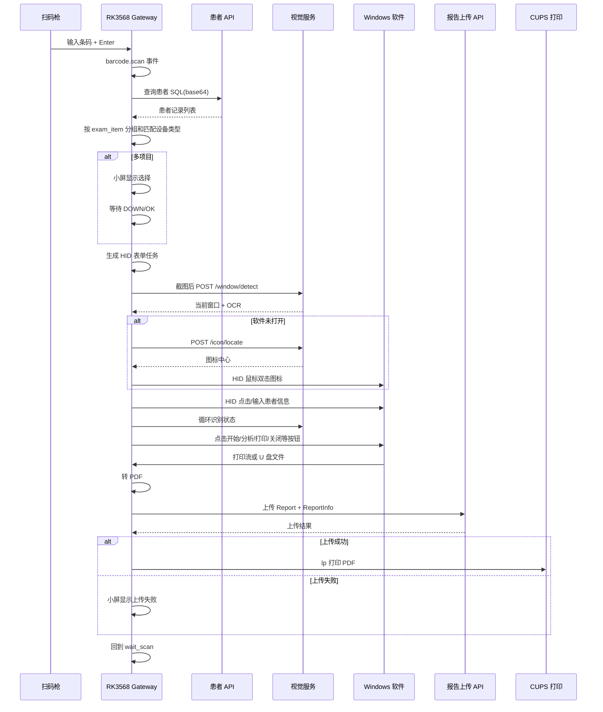

# RK3568/RK3588 Gateway 技术报告

生成日期: 2026-06-04

本地仓库: `D:\Documents\New project\rk3588_gateway`

当前重点设备: RK3568, `linaro@192.168.20.250`

板端运行目录: `/opt/rk3568_gateway`

板端数据目录: `/var/lib/rk3568-gateway`

主服务: `rk3568-gateway.service`

当前发布版本: `v0.913.68`

Python 包版本: `0.913.68`

代码包名: `rk3588_gateway`

## 1. 报告目的

这份报告从零开始说明 RK3568/RK3588 网关项目的技术设计。它不是单纯的使用说明，而是把程序架构、运行流程、核心原理、板端部署、外部接口、视觉识别、HID 自动录入、报告接收上传、小屏显示、故障处理和后续扩展方式完整串起来。

本项目虽然目录和 Python 包名仍叫 `rk3588_gateway`，但当前主线已经迁移到 RK3568 板子上运行。命名保留是历史兼容，不代表当前只能跑 RK3588。

本报告基于以下本地资料和代码生成:

| 来源 | 说明 |
| --- | --- |
| `D:\Documents\New project\HANDOFF_20260602.md` | 换电脑交接文件 |
| `README.md` | 项目总览 |
| `VERSION_NOTES.md` | 当前版本说明 |
| `pyproject.toml` / `VERSION` / `src/rk3588_gateway/__init__.py` | 版本号 |
| `config.example.yaml` | 默认配置 |
| `profiles/body_composition.yaml` | 原人体成分分析仪 profile |
| `profiles/bodypass.yaml` | BodyPass profile |
| `src/rk3588_gateway/*.py` | 主程序源码 |
| `scripts/*.py` / `scripts/*.sh` / `scripts/*.cc` | 板端脚本和视觉后端 |
| `systemd/*.service` | systemd 服务 |
| `tests/*.py` | 单元测试 |

生成报告时的 Git 状态:

```text
branch: main
HEAD: 0d985fc Release v0.913.68 BodyPass profile flow
tag: v0.913.68
```

当前工作区还有未提交改动:

```text
M scripts/fb_status.py
M src/rk3588_gateway/display.py
M src/rk3588_gateway/vision_flow.py
M src/rk3588_gateway/workflow.py
M tests/test_workflow_vision.py
```

因此，报告描述的是“当前工作区代码状态”，不是只描述 `v0.913.68` 标签里的静态代码。

## 2. 一句话定义

本项目把 RK3568 Debian 板子做成一台无头式医疗检查网关。它接扫码枪，查询医院患者接口，通过 USB HID 自动控制 Windows 检查软件，借助 HDMI 采集和视觉识别判断 Windows 界面状态，同时通过 USB 虚拟打印机和 USB 虚拟 U 盘接收报告文件，把报告转 PDF、上传接口、上传成功后再驱动实体打印机打印，并通过 SPI 小屏展示当前状态。

简化成一句话:

```text
扫码 -> 查患者 -> 判断检查项目 -> 视觉看 Windows 屏幕 -> HID 自动录入和点击 -> 接收报告 -> 转 PDF -> 上传 -> 打印 -> 小屏提示
```

## 3. 项目解决的问题

项目要解决的是一条很具体的现场流程:

1. 现场有 Windows 检查软件，原本需要人工打开软件、输入患者信息、点击按钮、等待检查、生成报告、打印。
2. 医院体检系统有患者接口，扫码后能查到患者和检查项目。
3. Windows 软件通常没有开放稳定 API，或者 API 不可控，因此只能通过模拟键鼠操作软件界面。
4. 仅靠固定坐标不可靠，因为软件窗口可能移动、弹窗可能延迟、状态切换时间不固定。
5. 因此需要视觉识别当前 Windows 屏幕状态，再决定下一步点击或输入。
6. 报告可能通过 Windows 打印流输出，也可能通过虚拟 U 盘导出。
7. 报告需要上传业务平台，上传成功后才允许实体打印，避免未上传就打印造成数据闭环失败。
8. 板子没有大屏幕，但需要让护士或操作员知道当前状态，所以加了 SPI 状态屏。

这个系统的核心设计思想是:

```text
用 RK3568 作为硬件中间层，把原本人工在 Windows 软件上的操作拆成可观测、可重试、可记录的状态机。
```

## 4. 当前目标环境

### 4.1 RK3568 板端

| 项目 | 当前值 |
| --- | --- |
| 板子 | ATK-DLRK3568-Debian |
| SoC | Rockchip RK3568 |
| 板子 IP | `192.168.20.250` |
| SSH 用户 | `linaro` |
| 运行目录 | `/opt/rk3568_gateway` |
| 数据目录 | `/var/lib/rk3568-gateway` |
| Python | `/opt/rk3568_gateway/.venv/bin/python`, Python 3.7.3 |
| 主服务 | `rk3568-gateway.service` |
| USB gadget 服务 | `rk3568-usb-gadget.service` |
| 小屏服务 | `rk3568-fb-status.service` |
| UDC | `fcc00000.dwc3` |
| 本地 API | `http://127.0.0.1:8080` |

### 4.2 Windows 主机侧

Windows 主机通过一根 USB OTG 线连接 RK3568。Windows 会看到一组由 RK3568 模拟出来的 USB 设备:

| Windows 看到的设备 | RK3568 板端节点 | 作用 |
| --- | --- | --- |
| USB 键盘 | `/dev/hidg0` | 自动输入文字、快捷键 |
| USB 鼠标 | `/dev/hidg1` | 自动点击屏幕坐标 |
| USB 打印机 | `/dev/g_printer0` | Windows 打印报告到板子 |
| USB U 盘 | backing image `/var/lib/rk3568-gateway/msc/ums_shared.img` | Windows 拷贝报告文件到板子 |

Windows 同时通过 HDMI 输出画面到 USB HDMI 采集卡，采集卡插在 RK3568 USB Host 口上。RK3568 通过 `/dev/video9` 抓取 Windows 屏幕截图。

### 4.3 外部业务接口

| 接口 | 当前用途 |
| --- | --- |
| `patient_api.endpoint` | 扫码后查询患者信息和检查项目 |
| `report_upload.endpoint` | 上传 PDF 报告和 `ReportInfo.xml` |
| `vision.icon_endpoint` | 输入截图和软件名，返回桌面图标坐标 |
| `vision.window_endpoint` | 输入截图，返回窗口框、OCR 文本和坐标 |

当前配置中的接口示例:

```yaml
patient_api:
  endpoint: "http://192.168.112.139:9061/api/client/getTJPatientInfo"

report_upload:
  endpoint: "http://192.168.112.139:9061/api/client/uploadOriginalReport"

vision:
  icon_endpoint: "http://127.0.0.1:5002/icon/locate"
  window_endpoint: "http://127.0.0.1:5002/window/detect"
```

历史上视觉接口运行在同事电脑或局域网电脑上，例如 `192.168.20.163:5002`。当前已经具备板端 RKNN 后端脚本，接口可以部署在 RK3568 本机，并让网关主程序调用 `127.0.0.1:5002`。

## 5. 高层架构

### 5.1 总体拓扑



### 5.2 主程序内部架构



### 5.3 为什么主程序和视觉后端用 HTTP 接口连接

即使视觉后端部署在同一块板子上，主程序仍然通过 HTTP 调用 `127.0.0.1:5002`，原因是:

1. 主业务服务和 AI 推理服务解耦，任一服务重启不会直接拖死另一个。
2. 视觉模型文件、RKNN runtime、C++ worker、Paddle OCR demo 依赖较重，独立进程更容易排错。
3. 以后可以把视觉从同事电脑迁到板子，也可以从板子迁到性能更好的边缘主机，而主程序只需要改 URL。
4. HTTP 请求天然有超时、错误码和 JSON 数据格式，便于日志记录和手动测试。
5. `curl` 或 Python 小脚本可以直接复现一张截图的识别结果，不必跑完整扫码流程。

## 6. 代码目录结构

核心目录:

```text
rk3588_gateway/
  config.example.yaml
  install_debian.sh
  pyproject.toml
  requirements.txt
  VERSION
  VERSION_NOTES.md
  profiles/
    body_composition.yaml
    bodypass.yaml
  src/rk3588_gateway/
    api.py
    compat.py
    config.py
    display.py
    events.py
    form.py
    gpio.py
    hid.py
    hid_output.py
    main.py
    msc_monitor.py
    patient_api.py
    print_capture.py
    printer.py
    queue.py
    report_pdf.py
    report_upload.py
    uploader.py
    vision_flow.py
    vm_transfer.py
    workflow.py
  scripts/
    setup_usb_composite_gadget.sh
    fb_status.py
    ppocr_rknn_server.py
    ppocr_rknn_worker.cc
    window_yolo_rknn.cc
    window_yolo_worker.cc
    open_login_probe.py
  systemd/
    rk3568-gateway.service
    rk3568-usb-gadget.service
    rk3568-fb-status.service
  tests/
    test_config_profiles.py
    test_open_login_probe.py
    test_vision_flow.py
    test_workflow_vision.py
  智能体UI/
    *.png
```

### 6.1 核心 Python 模块职责

| 文件 | 职责 |
| --- | --- |
| `main.py` | 程序入口，加载配置，创建所有组件，启动异步任务 |
| `config.py` | 配置 dataclass，读取 `config.yaml`，合并 profile |
| `api.py` | 本地 HTTP API，提供健康检查、扫码模拟、状态页、GPIO API |
| `workflow.py` | 主业务状态机，扫码后查患者、选项目、启动视觉/HID 录入 |
| `patient_api.py` | 构造 SQL，base64 包装，调用患者查询接口，解析记录 |
| `form.py` | 根据患者记录和 HID 模板生成可执行表单任务 |
| `hid.py` | 读取扫码枪 evdev 输入，按终止键生成 `barcode.scan` 事件 |
| `hid_output.py` | 写 `/dev/hidg0` 和 `/dev/hidg1`，模拟键盘鼠标 |
| `vision_flow.py` | 截图、调用视觉接口、判断 Windows 软件状态、执行视觉自动化 |
| `print_capture.py` | 读取 USB 虚拟打印机数据流，落地 `.prn` 文件 |
| `msc_monitor.py` | 监听 Mass Storage backing image 变化，挂载只读复制新文件 |
| `report_pdf.py` | 把打印流、图片、Office、文本等统一转 PDF |
| `report_upload.py` | 扫描 PDF，上传报告接口，成功后打印 |
| `printer.py` | 调用 CUPS `lp` 命令提交实体打印 |
| `gpio.py` | 读取 DOWN/OK 按键，支持 sysfs 和 gpiod |
| `display.py` | 生成网页状态页 HTML |
| `events.py` | 事件对象定义 |
| `queue.py` | SQLite 事件队列 |
| `uploader.py` | 通用事件上传器，当前默认关闭 |
| `vm_transfer.py` | SCP 到虚拟机或远端目录，当前默认关闭 |
| `compat.py` | Python 3.7 兼容工具 |

### 6.2 脚本职责

| 文件 | 职责 |
| --- | --- |
| `install_debian.sh` | 板端安装脚本，安装依赖、复制文件、创建 venv、安装 service |
| `setup_usb_composite_gadget.sh` | 使用 configfs 创建 USB 复合设备 |
| `fb_status.py` | ILI9488 SPI 小屏渲染脚本 |
| `ppocr_rknn_server.py` | 板端视觉 HTTP 服务，封装 PP-OCR RKNN、YOLO RKNN、图标模板匹配 |
| `ppocr_rknn_worker.cc` | 常驻 PP-OCR C++ worker，避免每次请求重新加载模型 |
| `window_yolo_worker.cc` | 常驻 YOLO RKNN window worker |
| `window_yolo_rknn.cc` | 单次 YOLO RKNN 推理工具 |
| `open_login_probe.py` | 手动视觉探测脚本，用于调试打开软件和登录 |

## 7. 运行服务

当前 RK3568 板端主要有三个 systemd 服务。

### 7.1 `rk3568-usb-gadget.service`

服务文件: `systemd/rk3568-usb-gadget.service`

职责:

1. 在主业务程序启动前配置 USB composite gadget。
2. 调用 `/opt/rk3568_gateway/scripts/setup_usb_composite_gadget.sh`。
3. 创建虚拟打印机、Mass Storage、HID 键盘、HID 鼠标。
4. 绑定 UDC。

重要特征:

```ini
Type=oneshot
ExecStart=/bin/bash /opt/rk3568_gateway/scripts/setup_usb_composite_gadget.sh
RemainAfterExit=yes
Before=rk3568-gateway.service
```

### 7.2 `rk3568-gateway.service`

服务文件: `systemd/rk3568-gateway.service`

职责:

1. 启动主业务 Python 程序。
2. 读取 `/opt/rk3568_gateway/config.yaml`。
3. 监听扫码枪、虚拟打印机、虚拟 U 盘、GPIO 按键。
4. 提供 `0.0.0.0:8080` 本地 API。
5. 管理自动录入、报告上传和打印。

启动命令:

```bash
/opt/rk3568_gateway/.venv/bin/python -m rk3588_gateway.main --config /opt/rk3568_gateway/config.yaml
```

服务以 root 运行，因为它要访问 USB gadget、GPIO、挂载 loop image 和打印节点。

### 7.3 `rk3568-fb-status.service`

服务文件: `systemd/rk3568-fb-status.service`

职责:

1. 控制 SPI ILI9488 小屏。
2. 启动前把 `spi1.0` 从内核 `fb_ili9486` 驱动切换到 `spidev`。
3. 调用 `scripts/fb_status.py`。
4. 轮询 `http://127.0.0.1:8080/display/state`。
5. 根据状态渲染 480x320 小屏画面。

当前命令核心参数:

```bash
--output ili9488
--spidev /dev/spidev1.0
--dc-gpio 116
--reset-gpio 109
--width 480
--height 320
--rotate 270
--spi-speed 16000000
--pixel-format 18
--interval 0.2
```

### 7.4 视觉服务

视觉服务不是主仓库 systemd 目录里固定的一项，但当前版本说明中有 `rk3568-ppocr.service` 的运行状态。它通常运行:

```bash
python3 /opt/rk3568_gateway/scripts/ppocr_rknn_server.py --host 0.0.0.0 --port 5002
```

它提供:

```text
GET  /health
POST /ocr
POST /window/detect
POST /detect_window
POST /icon/locate
POST /locate_icon
```

主程序只需要配置:

```yaml
vision:
  icon_endpoint: "http://127.0.0.1:5002/icon/locate"
  window_endpoint: "http://127.0.0.1:5002/window/detect"
```

## 8. USB Composite Gadget 原理

`scripts/setup_usb_composite_gadget.sh` 使用 Linux configfs 创建一个 USB 复合设备。

### 8.1 gadget 基础参数

脚本会写入:

```text
idVendor  = 0x2207
idProduct = 0x3568
product   = RK3568 HID Printer MSC Bridge
serial    = RK3568BRIDGE001
UDC       = fcc00000.dwc3
```

这让 Windows 主机把 RK3568 识别为一个 Rockchip 风格的复合 USB 设备。

### 8.2 function 组成

脚本创建四个 function:

| function | configfs 路径 | Windows 侧表现 | 板端设备 |
| --- | --- | --- | --- |
| Printer | `functions/printer.usb0` | USB 打印机 | `/dev/g_printer0` |
| Mass Storage | `functions/mass_storage.0` | 可移动 U 盘 | backing image |
| HID keyboard | `functions/hid.usb0` | 键盘 | `/dev/hidg0` |
| HID mouse | `functions/hid.usb1` | 鼠标 | `/dev/hidg1` |

并连接到同一个 configuration:

```bash
ln -s "$FUNCTIONS/printer.usb0" "$CONFIG/f1"
ln -s "$MSC_FUNCTION" "$CONFIG/f2"
ln -s "$FUNCTIONS/hid.usb0" "$CONFIG/f3"
ln -s "$FUNCTIONS/hid.usb1" "$CONFIG/f4"
```

### 8.3 HID 键盘描述符

键盘 function:

```text
protocol = 1
subclass = 1
report_length = 8
```

它使用标准 Boot Keyboard 8 字节 report:

```text
[modifier, reserved, key1, key2, key3, key4, key5, key6]
```

主程序每次按键会写一次按下 report，然后写全 0 report 表示释放。

### 8.4 HID 鼠标描述符

鼠标 function:

```text
protocol = 2
subclass = 1
report_length = 5
```

鼠标 report 为:

```text
[button, x_low, x_high, y_low, y_high]
```

这里不是相对鼠标，而是绝对坐标鼠标。X/Y 坐标范围是 0 到 32767。程序把 1920x1080 屏幕坐标映射成 HID 绝对坐标:

```text
hid_x = x * 32767 / (screen_width - 1)
hid_y = y * 32767 / (screen_height - 1)
```

所以视觉接口返回的坐标必须是原始 Windows 画面坐标。

### 8.5 Mass Storage backing image

脚本使用:

```text
/var/lib/rk3568-gateway/msc/ums_shared.img
```

作为 Windows 看到的 U 盘文件系统。默认大小由 `MSC_SIZE_MB` 控制，脚本里默认是 64 MB。它会用 `mkfs.vfat` 或 `mkfs.fat` 格式化，并设置卷标:

```text
RK3568MSC
```

主程序监听这个 image 的 mtime，一旦 Windows 写入报告文件，板子会等待静默后把 gadget 从 Windows 断开，挂载 image，只读复制文件，再重建 gadget 还给 Windows。

## 9. 配置系统

配置入口是:

```text
/opt/rk3568_gateway/config.yaml
```

本地模板是:

```text
config.example.yaml
```

配置加载逻辑在 `src/rk3588_gateway/config.py`。

### 9.1 配置整体结构

主配置由这些 section 组成:

| section | 作用 |
| --- | --- |
| `device` | 设备 ID、位置、设备类型、profile 状态目录 |
| `active_profile` | 当前启用的软件 profile |
| `profile_files` | profile YAML 文件列表 |
| `scanner` | 扫码枪 evdev 配置 |
| `patient_api` | 患者查询接口配置 |
| `hid_input` | HID 键鼠配置 |
| `vision` | HDMI 采集和视觉接口配置 |
| `printer` | CUPS 打印配置 |
| `print_capture` | USB 打印机捕获配置 |
| `report_pdf` | 报告转 PDF 配置 |
| `report_upload` | 报告上传配置 |
| `msc` | Mass Storage 监听配置 |
| `gpio` | DOWN/OK 按键配置 |
| `vm_transfer` | SCP 转发配置，默认关闭 |
| `uploader` | 通用事件上传器，默认关闭 |
| `local_api` | 本地 HTTP API 配置 |
| `storage` | SQLite 事件库路径 |
| `logging` | 日志级别 |

### 9.2 profile 机制

当前版本支持软件 profile 切换。主配置中:

```yaml
active_profile: bodypass
profile_files:
  - profiles/body_composition.yaml
  - profiles/bodypass.yaml
```

`config.py` 会先读取 `profile_files`，再读取内联 `profiles`，最后按 `active_profile` 选择一个 profile。

profile 可以覆盖:

1. `device.type`
2. `vision.software`
3. `vision.flow`
4. profile 内 `vision` 子配置项

这样就能在不改代码的情况下切换不同 Windows 软件流程。

### 9.3 当前内置 profile

#### `body_composition`

文件: `profiles/body_composition.yaml`

含义: 原“人体成分分析仪”流程。

关键配置:

```yaml
id: body_composition
device_type: "人体成分检查"
software: "人体成分分析仪"
flow: body_composition
vision:
  close_msc_popup_when_detected: true
```

#### `bodypass`

文件: `profiles/bodypass.yaml`

含义: BodyPass 软件流程。

关键配置:

```yaml
id: bodypass
device_type: "人体成分检查"
software: "BodyPass"
flow: bodypass
vision:
  close_msc_popup_when_detected: true
  wait_after_open: 4.0
  wait_after_action: 1.0
  max_runtime: 360.0
```

### 9.4 切换 profile

切到原人体成分分析仪:

```bash
sudo sed -i 's/^active_profile:.*/active_profile: body_composition/' /opt/rk3568_gateway/config.yaml
sudo systemctl restart rk3568-gateway.service
```

切到 BodyPass:

```bash
sudo sed -i 's/^active_profile:.*/active_profile: bodypass/' /opt/rk3568_gateway/config.yaml
sudo systemctl restart rk3568-gateway.service
```

检查当前 profile:

```bash
grep '^active_profile:' /opt/rk3568_gateway/config.yaml
cat /var/lib/rk3568-gateway/device/active_profile.txt
cat /var/lib/rk3568-gateway/device/software.txt
```

## 10. 主程序启动流程

入口在 `src/rk3588_gateway/main.py`。

启动过程:

1. 解析命令行 `--config`。
2. 调用 `load_config()` 读取 YAML。
3. 配置 logging。
4. 调用 `ensure_device_profile(config)`:
   - 创建 `/var/lib/rk3568-gateway/device`
   - 写入 `device_type.txt`
   - 写入 `active_profile.txt`
   - 写入 `software.txt`
   - 确保 `ReportInfo.xml` 目录存在
   - 迁移旧路径 `/var/lib/rk3568-gateway/ReportInfo.xml`
5. 创建 SQLite `EventQueue`。
6. 创建各个组件:
   - `Printer`
   - `GpioController`
   - `ReportPdfConverter`
   - `ReportUploadWorker`
   - `VmTransfer`
   - `PrintCapture`
   - `ScannerReader`
   - `Uploader`
   - `LocalApi`
   - `GatewayWorkflow`
   - `MscMonitor`
7. 把 `workflow` 注入 `local_api.workflow`。
8. 启动 GPIO。
9. 启动本地 API。
10. 创建后台任务:
    - `scanner.run()`
    - `print_capture.run()`
    - `msc_monitor.run()`
    - `report_upload.run()`
    - `uploader.run()`
    - `gpio_key_loop()`
11. 等待 SIGINT/SIGTERM。
12. 停止服务、取消任务、关闭 GPIO。

主程序是 asyncio 结构，但部分阻塞工作通过 `compat.to_thread()` 放到线程池执行，例如:

1. GStreamer 截图。
2. 读写虚拟打印机。
3. 挂载 U 盘 image。
4. PDF 转换。
5. 上传 worker 的文件扫描。

## 11. 事件系统

事件定义在 `events.py`，持久化在 `queue.py`。

### 11.1 事件对象

每个事件包含:

| 字段 | 说明 |
| --- | --- |
| `id` | uuid hex |
| `type` | 事件类型 |
| `device_id` | 设备 ID |
| `payload` | 事件内容 |
| `created_at` | UTC ISO 时间 |
| `attempts` | 上传尝试次数 |
| `last_error` | 最后错误 |

### 11.2 SQLite 表

事件保存在 `storage.sqlite_path`，默认:

```text
/var/lib/rk3568-gateway/events.db
```

事件队列表:

```text
events(id,type,device_id,created_at,payload,attempts,last_error)
```

### 11.3 事件类型示例

| 事件 | 来源 | 作用 |
| --- | --- | --- |
| `barcode.scan` | 扫码枪或 `/scan` API | 触发工作流 |
| `patient.query_failed` | 患者查询无结果 | 记录异常 |
| `patient.exam_mismatch` | 项目不匹配 | 记录不执行原因 |
| `patient.selected` | 选择患者项目 | 记录输入对象 |
| `hid.form_task` | 构造 HID 任务后 | 记录要执行的 HID 表单 |
| `hid.form_done` | HID/视觉流程完成 | 记录完成 |
| `hid.form_failed` | HID/视觉失败 | 记录错误 |
| `print.captured` | 虚拟打印机接收作业 | 进入报告链路 |
| `msc.file_copied` | 虚拟 U 盘复制新文件 | 进入报告链路 |
| `report.pdf_created` | 报告转 PDF 成功 | 上传 worker 处理 |
| `report.uploaded` | 上传成功 | 可打印 |
| `report.upload_failed` | 上传失败 | 不打印或提示 |
| `report.printed` | 实体打印提交成功 | 记录结果 |

事件系统的作用:

1. 为本地状态页提供最近事件和统计。
2. 为故障追溯留下记录。
3. 为未来对接云端事件上传保留接口。

## 12. 扫码枪输入原理

扫码枪读取在 `src/rk3588_gateway/hid.py`。

### 12.1 设备路径

配置示例:

```yaml
scanner:
  enabled: true
  event_device: "/dev/input/by-id/usb-USBKey_Chip_USBKey_Module_202730041341-event-kbd"
  terminator_keys: ["KEY_ENTER", "KEY_KPENTER"]
  min_length: 8
```

扫码枪本质上是 USB 键盘。程序用 `evdev.InputDevice` 打开 event 设备，读取 EV_KEY 事件。

### 12.2 字符映射

程序维护两张表:

1. `KEY_MAP`: 普通键到字符，例如 `KEY_A -> a`, `KEY_1 -> 1`
2. `SHIFT_KEY_MAP`: Shift 组合，例如 `KEY_MINUS -> _`

流程:

1. 按键按下时，把字符加入 buffer。
2. 遇到 `KEY_ENTER` 或 `KEY_KPENTER` 时认为扫码结束。
3. 把 buffer 拼成字符串。
4. 去掉空白。
5. 长度大于等于 `min_length` 才生成事件。
6. 短码被忽略并记录 warning。

生成事件:

```json
{
  "type": "barcode.scan",
  "payload": {
    "code": "P2605260007",
    "source": "/dev/input/by-id/..."
  }
}
```

### 12.3 本地模拟扫码

不插扫码枪也可以通过本地 API 模拟:

```bash
curl -sS -X POST http://127.0.0.1:8080/scan \
  -H "Content-Type: application/json" \
  -d '{"code":"P2605260007"}'
```

`api.py` 会写入 `barcode.scan` 事件，并调用 `workflow.start_scan(code)`。

## 13. 患者查询原理

患者接口在 `patient_api.py`。

### 13.1 SQL 构造

`build_patient_sql(scan)` 会构造查询 SQL。核心逻辑:

1. 用扫码文本匹配 `report_no`。
2. 也允许匹配 `patient_id`。
3. 也允许匹配 `patient_name`。
4. 只查询 `exam_state in ('10', '20', '30', '40')`。
5. 只查询最近 180 天。
6. 按 `req_date desc` 排序。
7. 最多返回 20 条。

返回字段包含:

| 字段 | 说明 |
| --- | --- |
| `exam_item` | 检查项目 |
| `his_exam_no` | HIS 检查号 |
| `report_no` | 报告号 |
| `patient_id` | 患者 ID |
| `patient_name` | 姓名 |
| `name_phonetic` | 拼音 |
| `xing` | 姓 |
| `ming` | 名 |
| `sex` | 性别 |
| `age` | 年龄 |
| `nian` | 出生年 |
| `yue` | 出生月 |
| `ri` | 出生日 |
| `birthday` | 出生日期 |

### 13.2 请求格式

接口请求体:

```json
{
  "sqlStr": "base64(sql)"
}
```

请求头:

```text
Content-Type: application/json;charset=UTF-8
Accept: application/json
User-Agent: RK3568-Gateway
```

### 13.3 原始响应保存

每次查询都会把原始响应保存到:

```text
/var/lib/rk3568-gateway/api_raw
```

文件名类似:

```text
api_20260603_031424_123456_200_P2605260007.json
```

这样即使后续解析失败，也能回看接口真实返回。

### 13.4 响应解析

`records_from_payload()` 支持多种返回结构:

1. 根对象中 `data` 是 list。
2. 根对象中 `data` 是 dict。
3. 根对象本身就是患者记录。
4. 根对象是 list。

并且会兼容检查项目字段:

```text
exam_item
exam_item_name
examItemName
examItem
```

## 14. 表单任务生成

表单任务生成在 `form.py`。

### 14.1 HID 模板

配置项:

```yaml
hid_input:
  template_path: "/opt/rk3568_gateway/MarkInfo_SearchTitle_Config_100.json"
```

模板里有 `eventClassList`，每个事件描述一个点击或输入动作。

### 14.2 患者字段归一化

程序提取这些字段:

```text
exam_item
his_exam_no
report_no
patient_id
patient_name
name_phonetic
xing
ming
age
nian
yue
ri
birthday
sex
```

性别会做归一化:

```text
1 / M / male   -> 男
2 / F / female -> 女
其他值原样保留
```

### 14.3 事件类型

当前 HID 模板主要支持:

| clickType | 含义 |
| --- | --- |
| `0` | 鼠标点击 |
| `1` | 点击输入框并输入文本 |
| `7` | 条件点击，例如按性别选择某个按钮 |

对 `clickType=1`:

1. 模板中的 `text` 字段表示患者字段名。
2. 程序从患者记录里取同名字段。
3. 生成 `value`。

最终任务结构:

```json
{
  "scan_text": "P2605260007",
  "patient": {
    "patient_id": "...",
    "patient_name": "...",
    "sex": "男"
  },
  "title": "...",
  "windowTitleLocation": "...",
  "eventClassList": [
    {"clickType": 1, "x": 100, "y": 200, "field": "patient_id", "value": "..."}
  ]
}
```

## 15. 主业务状态机

主业务状态机在 `workflow.py` 的 `GatewayWorkflow`。

### 15.1 状态字段

`display_state` 是全局状态源，供网页和 SPI 小屏使用。

主要字段:

| 字段 | 说明 |
| --- | --- |
| `screen` | 当前界面状态 |
| `title` | 标题 |
| `message` | 消息 |
| `items` | 可选检查项目 |
| `selected_index` | 当前选中项 |
| `scan` | 当前扫码 |
| `popup` | 临时弹窗 |
| `exam_item` | 当前项目 |
| `patient_exam_items` | 患者所有项目 |
| `device_type` | 当前设备项目 |

### 15.2 主要 screen

| screen | 含义 |
| --- | --- |
| `wait_scan` | 等待患者报到 |
| `querying` | 正在查询申请单 |
| `select_item` | 多项目或非自动匹配，需要按键选择 |
| `wait_report` | 已选中患者，正在检查，准备自动录入 |
| `inputting` | HID 已开始模拟，正在自动录入 |
| `upload_done` | 当前录入流程结束，可继续扫码 |
| `not_found` | 未找到申请单 |
| `exam_mismatch` | 患者项目与设备不符 |
| `printer_error` | 打印或链路异常 |

### 15.3 扫码流程



### 15.4 项目匹配规则

程序把设备类型和患者检查项目都去掉空白后比较。

匹配条件:

```text
candidate == target
或 target in candidate
```

例如:

```text
设备类型: 人体成分检查
患者项目: 人体成分检查, 心电图
```

程序会先把多项目字符串按这些分隔符拆开:

```text
； 、 ， ; 换行 \r \t | ｜ / ／ \ + ＋
```

然后按项目独立生成可选项。

### 15.5 多项目选择

当患者有多个检查项目，或者不是唯一自动匹配时，状态变为 `select_item`。

GPIO 按键:

| 按键 | 作用 |
| --- | --- |
| DOWN | 选中下一个项目 |
| OK | 确认当前项目 |

程序的 GPIO loop 每 0.12 秒刷新一次输入，只在上升沿触发。

### 15.6 HID 活动保护

`workflow.py` 有 `_hid_input_active` 标记。

当视觉/HID 自动录入进行中:

1. 新扫码会被忽略。
2. Mass Storage 读取会被延迟，避免自动录入过程中断开 USB gadget。
3. 小屏显示 `正在检查` / `正在自动录入`。

这是为了避免 Windows 正在接收 HID 输入时又来了新的扫码，导致患者信息混入。

## 16. HID 自动输入原理

HID 输出在 `hid_output.py`。

### 16.1 后端类型

支持两类后端:

| 后端 | 用途 |
| --- | --- |
| `usb_gadget` | 直接写 `/dev/hidg0` 和 `/dev/hidg1` |
| `ch9350` | 外置 CH9350 串口 HID 模块，作为备用方案 |

当前 RK3568 主线使用:

```yaml
keyboard_backend: "usb_gadget"
mouse_backend: "usb_gadget"
keyboard_device: "/dev/hidg0"
mouse_device: "/dev/hidg1"
```

### 16.2 鼠标点击

点击流程:

1. 1920x1080 坐标转换成 0..32767 绝对坐标。
2. 写一次 button=0 的移动 report。
3. 等待 `HID_MOUSE_SETTLE_SECONDS`。
4. 写 button=1 表示按下。
5. 等待 `HID_MOUSE_HOLD_SECONDS`。
6. 写 button=0 表示释放。

### 16.3 ASCII 输入

ASCII 字符通过 HID 键盘表输入。

流程:

1. 点击输入框。
2. Ctrl+A 全选。
3. 如果 `force_caps_ascii=true`，先确保 CapsLock 打开。
4. 按小写字母键输入，利用 CapsLock 得到大写效果。
5. 结束后恢复 CapsLock 状态。

这样做是为了避免 Windows 侧当前 CapsLock 状态不确定，导致条码大小写错误。

### 16.4 中文输入

中文或非 ASCII 不能直接用标准 HID 键盘码输入。当前方案是 Windows PowerShell 剪贴板:

1. 发送 `Win+R`。
2. 输入一条 PowerShell 命令。
3. 命令用 `[char]编码` 拼出完整文本。
4. PowerShell 调用 `Set-Clipboard -Value (...)`。
5. 等待 `powershell_wait_ms`。
6. 点击目标输入框。
7. Ctrl+A 全选。
8. Ctrl+V 粘贴。

命令形式:

```powershell
powershell -sta -nop -w hidden -c "Set-Clipboard -Value ([char]张+[char]三...)"
```

优点:

1. 不依赖 Windows 输入法。
2. 可输入中文姓名。
3. 可以在没有软件 API 的情况下保持稳定。

风险:

1. Windows 禁用 PowerShell 或剪贴板策略时会失败。
2. `powershell_wait_ms` 太短时可能尚未写入剪贴板。
3. Win+R 被安全策略拦截时无法使用。

### 16.5 文件描述符关闭

RK3568 vendor 4.19 内核对 HID gadget 比较敏感。项目中有保护逻辑:

1. HID 表单执行结束后关闭 `/dev/hidg0` 和 `/dev/hidg1` fd。
2. Mass Storage 准备 unbind gadget 前也会关闭 HID fd。
3. 避免 gadget 重建时文件描述符仍被占用。

## 17. 视觉流程总览

视觉流程在 `vision_flow.py`。

它负责做三件事:

1. 从 `/dev/video9` 抓取 Windows 当前屏幕。
2. 调用视觉接口识别图标、窗口、OCR 文本。
3. 根据识别结果决定下一步点击、输入或等待。

当前支持两个 flow:

| flow | 软件 | profile |
| --- | --- | --- |
| `body_composition` | 原“人体成分分析仪” | `body_composition` |
| `bodypass` | BodyPass | `bodypass` |

## 18. HDMI 截图原理

### 18.1 采集设备

当前 RK3568 使用 USB HDMI 采集卡:

```text
MACROSILICON USB Video 534d:2109
设备节点: /dev/video9
格式: MJPG 1920x1080@30
GStreamer io-mode: 2
```

配置:

```yaml
vision:
  device: "/dev/video9"
  capture_format: "mjpg"
  capture_width: 1920
  capture_height: 1080
  capture_framerate: 30
  capture_frames: 30
  capture_io_mode: 2
```

### 18.2 GStreamer 命令

MJPG 模式下命令类似:

```bash
gst-launch-1.0 -q -e \
  v4l2src device=/dev/video9 io-mode=2 num-buffers=30 ! \
  'image/jpeg,width=1920,height=1080,framerate=30/1' ! \
  multifilesink location=/tmp/rk3568-vision-flow/.window_1_%02d.jpg
```

### 18.3 为什么连续取 30 帧

USB HDMI 采集刚启动时可能出现:

1. 首帧黑屏。
2. 帧不完整。
3. 文件太小。
4. JPEG 结尾缺失。

因此程序会:

1. 连续取 `capture_frames` 帧。
2. 查找所有 `.xxx_%02d.jpg`。
3. 只接受 JPEG 头尾正确的文件。
4. 优先选择最大文件，而不是简单取最后一帧。
5. 要求文件大小大于 `MIN_CAPTURE_FRAME_BYTES = 64 KiB`。
6. 最多重试 `MAX_CAPTURE_ATTEMPTS = 4`。

这个逻辑在测试里覆盖:

1. 优先选择最大稳定帧。
2. 忽略非 JPEG 大文件。
3. 小黑帧时重试。

### 18.4 视觉请求格式

截图会被 base64 编码:

```json
{
  "image_base64": "..."
}
```

图标定位额外带软件名:

```json
{
  "image_base64": "...",
  "software": "BodyPass"
}
```

### 18.5 视觉响应坐标约定

所有响应坐标必须是原始 1920x1080 屏幕坐标，不是模型输入 640 或 OCR 裁剪图坐标。

窗口检测响应示例:

```json
{
  "ok": true,
  "ocr": [
    {
      "text": "新建患者",
      "center": [176, 227],
      "box": [130, 214, 222, 240],
      "score": 0.91
    }
  ],
  "image_size": {"width": 1920, "height": 1080},
  "windows": [
    {
      "label": "1",
      "box": [103, 104, 806, 738],
      "ocr": []
    }
  ]
}
```

图标定位响应示例:

```json
{
  "ok": true,
  "center": [267, 924],
  "box": [224, 893, 310, 955],
  "template_score": 0.84,
  "matched_template": "BodyPass"
}
```

## 19. 原人体成分分析仪视觉流程

这是 `flow=body_composition`。

### 19.1 总体流程



### 19.2 状态判断逻辑

`vision_flow.py` 不再依赖固定 label 代表固定窗口含义。当前策略是 OCR 优先:

| 函数 | 判断依据 |
| --- | --- |
| `is_login_window` | 有 `登录`，并且有 `用户登录` 或 `用户名 + 密码` |
| `is_new_patient_window` | 有 `开单科室 + 患者号 + 确认`，或完整新建患者表单 OCR |
| `is_ready_to_create_patient` | 有 `新建患者`，同时有 `未选择患者`、`就绪`、`检查完成` 或 `开始检查` |
| `is_ready_to_start_check` | 有 `就绪` 和 `开始检查` |
| `is_check_complete` | 有 `检查完成` 和 `数据分析` |
| `is_pdf_report_prompt` | 有 `是否生成PDF报告` |
| `is_report_generated` | 有 `检查报告已生成` 和 `确认/确定` |

### 19.3 优先级

视觉判断中，弹窗和表单优先于主窗口:

1. PDF 生成提示优先。
2. 报告生成完成提示优先。
3. 旧 label `4/5` 弹窗兼容逻辑优先。
4. 新建患者表单优先。
5. 登录窗口。
6. 主窗口的新建患者。
7. 开始检查。
8. 检查完成和数据分析。
9. 无窗口时打开图标。

原因是同一张截图里可能同时检测到主窗口和弹窗。如果先处理主窗口，会点错。

### 19.4 PDF 提示中为什么选 Y 坐标更大的“是”

部分 OCR 会同时识别:

```text
是(Y)
是
否(N)
```

按钮区域里真正可点的“是”可能比标题或说明里的“是”更靠下。程序在 PDF 提示中查找包含“是”的 OCR 项，选择 Y 坐标最大的项点击。

### 19.5 U 盘弹窗自动关闭

Windows 看到 RK3568 的 Mass Storage 后，可能弹出资源管理器窗口，影响视觉识别和 HID 点击。

程序检测这些关键词:

```text
RK3568MSC
驱动器工具
搜索RK3568MSC
此电脑
选择要预览的文件
```

只要检测到 U 盘资源管理器窗口，就计算右上角关闭按钮位置并点击关闭。

当前策略是“检测到就关闭”，而不是只在某个流程节点关闭，因为现场测试发现 U 盘弹窗可能延迟很久才出现。

## 20. BodyPass 视觉流程

这是 `flow=bodypass`。

### 20.1 BodyPass 目标流程

用户定义的流程是:

1. 接口触发扫码后，先检测 BodyPass 是否打开。
2. 如果没有打开，定位桌面图标并打开。
3. 检测到 `人体成分数据管理程序（BodyPass）` 主窗口后，认为软件已打开。
4. 在 `编号` 后面的白色输入框输入患者 ID。
5. 在 `姓名` 后面的输入框输入姓名。
6. 点击 `传输会员信息`。
7. 等待 `Machine State = 显示检测结果`。
8. 点击 `测量明细`。
9. 等待 `检测结果明细` 窗口。
10. 点击 `预览检测结果`。
11. 等待 `预览` 窗口。
12. 点击 `打印`。
13. 等待小窗口 `打印`。
14. 点击 `打印（P）`。
15. 打印完成后点击预览窗口 `关闭`。
16. 再点击检测结果明细窗口 `关闭`。
17. 流程结束，回到 BodyPass 主界面。

### 20.2 BodyPass 关键 OCR 文本

程序内置文本:

| 常量 | 文本 |
| --- | --- |
| `BODYPASS_TITLE_TEXTS` | `人体成分数据管理程序`, `Body Pass程序` |
| `BODYPASS_MEMBER_ID_TEXT` | `编号` |
| `BODYPASS_MEMBER_NAME_TEXT` | `姓名` |
| `BODYPASS_RESULT_STATE_TEXT` | `显示检测结果` |
| `BODYPASS_TRANSFER_TEXTS` | `传输会员信息`, `传输会员` |
| `BODYPASS_DETAIL_TEXTS` | `测量明细` |
| `BODYPASS_DETAIL_WINDOW_TEXTS` | `检测结果明细` |
| `BODYPASS_PREVIEW_RESULT_TEXTS` | `预览检测结果` |
| `BODYPASS_PREVIEW_WINDOW_TEXTS` | `预览`, `人体成分分析报告`, `模拟签名`, `身体成分分析` |
| `BODYPASS_PRINT_TEXTS` | `打印` |
| `BODYPASS_PRINT_DIALOG_TEXTS` | `打印(P)`, `打印（P）`, `打印（P)` |
| `BODYPASS_PRINT_DIALOG_READY_TEXTS` | `选择打印机`, `打印到文件`, `页面范围`, `取消`, 打印按钮 |
| `BODYPASS_CLOSE_TEXTS` | `关闭` |

### 20.3 BodyPass 主要函数

| 函数 | 作用 |
| --- | --- |
| `run_bodypass_until_done` | BodyPass 完整流程入口 |
| `prepare_bodypass_main_window` | 等待或打开 BodyPass 主窗口 |
| `input_bodypass_member` | 输入编号和姓名 |
| `wait_for_bodypass_condition` | 循环截图，直到某个条件成立 |
| `click_bodypass_toolbar_button` | 点击工具栏按钮，优先用主窗口相对坐标 |
| `click_bodypass_print_dialog` | 点击打印弹窗的打印按钮 |
| `bodypass_main_window` | 从响应中找到 BodyPass 主窗口 |
| `bodypass_input_center` | 根据 `编号` 或 `姓名` OCR 定位右侧输入框 |
| `bodypass_machine_state_ready` | 判断 Machine State 是否显示检测结果 |

### 20.4 BodyPass 相对坐标兜底

OCR 对小字和工具栏按钮不稳定。当前 BodyPass 对几个按钮采用“窗口识别 + 相对坐标”的方式。

主窗口左上角为 `(box[0], box[1])`。

| 动作 | 相对偏移 |
| --- | --- |
| `传输会员信息` | `(820, 94)` |
| `测量明细` | `(570, 94)` |
| 预览窗口 `打印` | `(790, 78)` |
| 预览窗口 `关闭` | `(923, 78)` |
| 检测结果明细窗口 `关闭` | `(920, 190)` |
| 打印弹窗 `打印（P）` | `(393, 721)` |
| `编号/姓名` 输入框 X 偏移 | `窗口左上角 x + 218` |

这样设计的原因:

1. 只要窗口框识别准确，按钮坐标就稳定。
2. 不再依赖 OCR 精确识别“打印”“关闭”等短文本。
3. 窗口移动也不影响，因为坐标相对窗口左上角。

### 20.5 BodyPass 测试覆盖

`tests/test_vision_flow.py` 中有 BodyPass 完整流程测试。测试验证:

1. 未打开时先调用图标打开。
2. 检测主窗口。
3. 输入 `P2605260007` 和 `张三`。
4. 点击传输会员信息。
5. 等待 `Machine State=显示检测结果`。
6. 点击测量明细。
7. 点击预览检测结果。
8. 点击打印。
9. 点击打印弹窗。
10. 关闭预览。
11. 关闭检测结果明细。

测试中的典型主窗口 box:

```text
[467, 166, 1479, 895]
```

因此相对坐标计算出的点击点包括:

```text
传输会员信息: (1287, 260)
测量明细:     (1037, 260)
预览打印:     (1257, 244)
预览关闭:     (1390, 244)
明细关闭:     (1387, 356)
```

## 21. 板端 RKNN 视觉后端

板端视觉后端脚本是 `scripts/ppocr_rknn_server.py`。

### 21.1 后端组件

| 组件 | 类 | 作用 |
| --- | --- | --- |
| OCR | `OcrRunner` | 调 PP-OCR RKNN 检测和识别 |
| 窗口检测 | `WindowRunner` | 调 YOLOv8 RKNN 检测窗口 |
| 图像裁剪 | `CropRunner` | 按窗口 box 裁剪和放大 |
| 图标定位 | `IconTemplateRunner` | 模板匹配桌面图标 |
| 常驻进程 | `LineWorker` | 启动 C++ worker，模型加载一次，后续按行请求 |
| HTTP | `OcrHandler` | 提供 `/ocr`, `/window/detect`, `/icon/locate`, `/health` |

### 21.2 默认路径

```text
DEFAULT_DEMO_DIR       = /userdata/aidemo/rknn_PPOCR-System_demo_native
DEFAULT_WINDOW_DIR     = /userdata/aidemo/window_yolo
DEFAULT_ICON_DIR       = /userdata/aidemo/icon_match
DEFAULT_IMAGE_TOOLS_DIR= /userdata/aidemo/image_tools
```

模型和二进制默认:

| 类型 | 路径 |
| --- | --- |
| PP-OCR det | `model/ppocrv4_det.rknn` |
| PP-OCR rec | `model/ppocrv4_rec.rknn` |
| PP-OCR 单次 demo | `rknn_ppocr_system_demo` |
| PP-OCR 常驻 worker | `rknn_ppocr_system_worker` |
| YOLO window RKNN | `window_yolov8n_640_add9.rknn` |
| YOLO 单次工具 | `window_yolo_rknn` |
| YOLO 常驻 worker | `window_yolo_worker` |
| icon 模板匹配 | `icon_template_match` |
| crop 工具 | `image_crop_resize` |

### 21.3 `/health`

`GET /health` 检查所有运行文件是否存在。

响应字段:

```json
{
  "ok": true,
  "backend": "rk3568_vision_rknn",
  "demo_dir": "...",
  "window_dir": "...",
  "icon_dir": "...",
  "image_tools_dir": "...",
  "ocr_missing": [],
  "window_missing": [],
  "icon_missing": [],
  "crop_missing": []
}
```

如果缺模型或二进制，HTTP 状态返回 503。

### 21.4 `/ocr`

`POST /ocr` 只做 OCR。

请求支持:

1. JSON base64:

```json
{"image_base64": "..."}
```

2. 原始 image bytes:

```text
Content-Type: image/jpeg
```

返回:

```json
{
  "ok": true,
  "ocr": [
    {
      "index": 0,
      "polygon": [[x1,y1],[x2,y2],[x3,y3],[x4,y4]],
      "box": [x1,y1,x2,y2],
      "center": [cx,cy],
      "text": "识别文本",
      "score": 0.98
    }
  ],
  "image_size": {"width": 1920, "height": 1080},
  "elapsed_ms": 123
}
```

### 21.5 `/window/detect`

`POST /window/detect` 组合了 YOLO window 和 OCR。

流程:

1. 解码输入图片。
2. 调 `WindowRunner` 得到窗口 box。
3. 如果有窗口:
   - 按窗口 box 裁剪。
   - 对裁剪图做 OCR。
   - 把 OCR 坐标映射回原图坐标。
   - 把 OCR 分配到对应 window。
4. 如果没有窗口:
   - 对整张图做 OCR。
   - 返回一个 label 为 `None` 的整屏 window。

返回:

```json
{
  "ok": true,
  "ocr": [],
  "image_size": {"width": 1920, "height": 1080},
  "elapsed_ms": 500,
  "windows": [
    {
      "label": "0",
      "box": [467, 166, 1479, 895],
      "score": 0.85,
      "ocr": []
    }
  ],
  "window_elapsed_ms": 35
}
```

### 21.6 `/icon/locate`

`POST /icon/locate` 用于桌面图标定位。

流程:

1. 读取 `software` 字段。
2. 如果有对应模板，调用 `icon_template_match`。
3. 如果没有模板，则用 OCR 文本匹配软件名。
4. 返回图标中心点。

当前模板:

| software | 模板文件 |
| --- | --- |
| `人体成分分析仪` | `bodypass.jpg` |
| `BodyPass` | `bodypass_bodypass.jpg` |

### 21.7 常驻 worker 为什么提速明显

最早的方式是每次请求都 `subprocess.run()` 启动 demo。这样每次都要:

1. 启动新进程。
2. 初始化 RKNN runtime。
3. 读取模型文件。
4. 加载模型到 NPU。
5. 推理。
6. 退出进程。

常驻 worker 模式下:

1. 服务启动时加载一次模型。
2. 后续请求只把图片路径或参数写到 worker stdin。
3. worker 推理后输出一行 JSON。
4. Python HTTP 服务解析 JSON 返回。

因此大幅减少模型加载开销，尤其对 PP-OCR det + rec 两个模型更明显。

## 22. 报告接收链路

项目支持两种报告入口:

1. Windows 打印到 USB 虚拟打印机。
2. Windows 拷贝文件到 USB 虚拟 U 盘。

两条入口都会进入统一的:

```text
原始文件 -> 转 PDF -> report_upload worker -> 上传成功 -> 实体打印
```

## 23. USB 虚拟打印机链路

打印捕获在 `print_capture.py`。

### 23.1 打开设备

程序打开:

```text
/dev/g_printer0
```

优先 `O_RDWR | O_NONBLOCK`，失败时退回只读。

### 23.2 作业边界判断

打印机数据是流式的，程序用空闲时间判断一个 job 结束:

1. 有数据时创建新 `.prn` 文件。
2. 持续写入。
3. 如果超过 `idle_complete_seconds` 没有新数据，认为作业结束。
4. 如果总大小小于 `min_job_bytes`，认为无效并删除。

配置:

```yaml
print_capture:
  output_dir: "/var/lib/rk3568-gateway/print_jobs"
  chunk_size: 65536
  idle_complete_seconds: 2
  min_job_bytes: 128
```

输出文件:

```text
/var/lib/rk3568-gateway/print_jobs/print_YYYYMMDD_HHMMSS_micro.prn
```

### 23.3 完成后的动作

作业完成后:

1. 写事件 `print.captured`。
2. 调 `ReportPdfConverter.convert(path, "print")`。
3. 转成功后写事件 `report.pdf_created`。
4. 如果配置了直接打印，则可提交实体打印。
5. 可选 SCP 到 VM，当前默认关闭。

当前主线更推荐让 `report_upload.py` 统一处理 PDF 上传和上传成功后打印。

## 24. USB Mass Storage 链路

U 盘监听在 `msc_monitor.py`。

### 24.1 为什么不能直接读 backing image

Mass Storage backing image 同时被 Windows 当作 U 盘使用。如果板子在 Windows 写入时直接挂载读写，可能造成 FAT 文件系统损坏。因此必须:

1. 先观察 image mtime。
2. 等待 Windows 写入静默。
3. unbind UDC，让 Windows 断开 U 盘。
4. 板子只读挂载 image。
5. 复制文件。
6. umount。
7. 重建 gadget。

### 24.2 监听流程



### 24.3 去重策略

每个文件计算:

```text
signature = rel_path | size | sha256
```

记录在:

```text
/var/lib/rk3568-gateway/msc_state/seen.db
/var/lib/rk3568-gateway/msc_state/files.jsonl
```

这样同一个文件不会反复复制和上传。

### 24.4 忽略目录

默认忽略:

```yaml
ignore_names:
  - "System Volume Information"
  - "$RECYCLE.BIN"
```

也会忽略 `~$` 开头的 Office 临时文件。

## 25. PDF 转换链路

PDF 转换在 `report_pdf.py`。

目标目录:

```text
/var/lib/rk3568-gateway/reports_pdf
```

目标文件名:

```text
YYYYMMDD_HHMMSS_micro_source_type_safe_name.pdf
```

转换优先级:

1. 如果源文件已经是 PDF，直接 copy。
2. 如果是 PostScript，使用 `ps2pdf`。
3. 如果是图片，用 Pillow 转 PDF。
4. 如果是 Office 文档，用 LibreOffice headless 转 PDF。
5. 如果是文本，尝试 UTF-8，再尝试 GB18030，用 Pillow 渲染成 PDF。
6. 如果都失败，生成占位 PDF，记录原文件名、大小和无法转换说明。

支持字体查找:

```text
/usr/share/fonts/truetype/wqy/wqy-microhei.ttc
/usr/share/fonts/truetype/wqy/wqy-zenhei.ttc
/usr/share/fonts/opentype/noto/NotoSansCJK-Regular.ttc
/usr/share/fonts/truetype/dejavu/DejaVuSans.ttf
```

这保证中文文本能尽量正常显示。

## 26. 报告上传链路

上传 worker 在 `report_upload.py`。

### 26.1 扫描目录

监听:

```text
report_pdf.output_dir
```

默认:

```text
/var/lib/rk3568-gateway/reports_pdf
```

每 `poll_interval_seconds` 扫描一次。

### 26.2 基线机制

`init_baseline=true` 时，如果状态文件为空，worker 会把已有 PDF 标记为 baseline，不上传旧文件。

状态文件:

```text
/var/lib/rk3568-gateway/report_upload_state/uploads.jsonl
```

### 26.3 文件签名

每个 PDF 计算:

```text
signature = file_name | size | sha256
```

如果签名已上传、已 baseline 或已最终 failed，就不重复处理。

### 26.4 上传格式

上传使用 multipart/form-data，两个文件字段:

| 字段名 | 内容 |
| --- | --- |
| `Report` | PDF 文件 |
| `ReportInfo` | `/var/lib/rk3568-gateway/device/ReportInfo.xml` |

HTTP 头:

```text
Content-Type: multipart/form-data; boundary=...
User-Agent: RK3568-Gateway
```

### 26.5 成功判断

HTTP 2xx 只是必要条件，不是充分条件。程序还会解析 JSON:

失败条件包括:

1. `success` 是 `false`。
2. `code` 是 `FAIL`, `FAILED`, `ERROR`。
3. `code` 存在但不是 `SUCCESS`。
4. `data.code` 是 `201`, `203`, `205`, `202`, `204`, `FAIL`, `FAILED`, `ERROR`。

成功条件包括:

1. 非 JSON 但 HTTP 2xx，按成功处理。
2. `success` 是 `true`。
3. `code` 是 `SUCCESS`。
4. `data.code` 是 `100` 或 `SUCCESS`。

### 26.6 上传成功后打印

只有上传成功才调用:

```python
printer.print_file_blocking(pdf_path, title="uploaded report")
```

并写事件:

```text
report.printed
或 report.print_failed
```

这就是“先上传，后打印”的闭环。

## 27. CUPS 实体打印

打印封装在 `printer.py`。

默认命令:

```yaml
printer:
  enabled: true
  command: "lp"
  printer_name: "HP_DeskJet_4900"
  timeout_seconds: 60
```

实际命令:

```bash
lp -d HP_DeskJet_4900 -t "uploaded report" /path/to/report.pdf
```

如果 `printer_name` 为空，则使用 CUPS 默认打印机。

## 28. 本地 HTTP API

API 在 `api.py`，默认监听:

```yaml
local_api:
  enabled: true
  host: "0.0.0.0"
  port: 8080
```

### 28.1 路由表

| 方法 | 路径 | 说明 |
| --- | --- | --- |
| GET | `/health` | 健康检查 |
| GET | `/status` | 队列数量和设备状态 |
| GET | `/events` | 最近事件 |
| POST | `/scan` | 模拟扫码并触发 workflow |
| POST | `/print` | 打印文本 |
| GET | `/display` | 网页状态页 |
| GET | `/display/state` | 小屏和网页使用的 JSON 状态 |
| GET | `/gpio` | GPIO 快照 |
| POST | `/gpio/{name}` | 设置 GPIO 输出 |
| POST | `/gpio/{name}/pulse` | GPIO 脉冲 |

### 28.2 `/display/state`

这个接口是显示系统的数据源。

返回包括:

| 字段 | 说明 |
| --- | --- |
| `device` | 设备 ID、位置、类型 |
| `display` | 当前 workflow 状态 |
| `queued_events` | 事件队列数量 |
| `print_jobs` | 打印捕获事件数量 |
| `msc_files` | U 盘复制事件数量 |
| `last_scan` | 最近条码 |
| `gpio` | GPIO 快照 |
| `events` | 精简事件列表 |

当看到 `print.captured` 或 `msc.file_copied`，会调用 workflow 显示接收弹窗。

当看到 `report.uploaded` 或 `report.upload_failed`，会调用 workflow 显示上传结果弹窗。

## 29. 状态显示系统

项目有两套显示:

1. 浏览器状态页: `display.py` 生成 HTML。
2. SPI 小屏: `scripts/fb_status.py` 直接渲染到 ILI9488。

两者数据源相同:

```text
GET http://127.0.0.1:8080/display/state
```

### 29.1 网页状态页

`display.py` 中内嵌完整 HTML/CSS/JS。

特点:

1. 适配 480x320 屏幕视觉风格。
2. 每 800 ms 拉取 `/display/state`。
3. 根据 `screen` 显示候诊、选择、检查、自动录入、上传成功、异常等状态。
4. 显示最近扫码、队列数量、打印数量、U 盘文件数量。
5. 有 popup 覆盖层显示报告接收和上传结果。

### 29.2 SPI ILI9488 小屏

`fb_status.py` 使用 Pillow 自绘。

当前特性:

1. 支持 `/dev/fb0` 输出和 ILI9488 SPI 直刷。
2. 当前 RK3568 使用 ILI9488 SPI 直刷。
3. 使用 `智能体UI` 中的 PNG 资产作为优先显示。
4. 如果资产不存在，则使用代码绘制卡片。
5. 有启动自检动画。
6. 有状态缓存，状态没变时不重复写屏。
7. 即使状态没变，也会每 `max_static_refresh_seconds` 强制刷新一次。
8. `render_state_key` 会忽略 `updated_at`，避免时间戳导致 0.2 秒一次重绘。
9. 捕获渲染异常，避免小屏脚本因为单次绘制失败退出。

### 29.3 启动画面规则

小屏启动后会检查系统 uptime:

```text
system_uptime_seconds() <= boot_animation_max_uptime
```

默认 `boot_animation_max_uptime=240` 秒。只有板子刚开机时显示“智能体已经连接”这类启动动画。服务单独重启时不再反复显示启动动画，正常进入候诊。

### 29.4 HID 阶段显示规则

当前逻辑:

1. 扫码并选中患者后，先显示:

```text
正在检查
正在准备自动录入
```

2. 只有 `VisionFlow` 真正调用 `on_hid_start`，准备执行 HID 输入时，才显示:

```text
正在检查
正在自动录入
```

这样避免视觉识别、等待窗口、等待软件打开时就提前显示“自动录入”。

### 29.5 视觉和 HID 时小屏不闪烁

之前小屏规律性闪烁的原因通常是:

1. `/display/state` 每次都有新的 `updated_at`。
2. 小屏脚本误以为状态变了。
3. 每 0.2 秒重绘整帧。

当前解决:

1. `render_state_key` 去掉 `updated_at`。
2. 比较渲染后的 image bytes。
3. 相同画面不写屏。
4. 只在状态改变或超过静态刷新间隔时写屏。

## 30. 安装部署

### 30.1 依赖包

`install_debian.sh` 安装:

```text
python3 python3-venv python3-pip python3-dev build-essential
cups cups-filters ghostscript printer-driver-hpcups hplip
libreoffice
rsync curl nano openssh-client sshpass
dosfstools util-linux gpiod
fonts-wqy-microhei
libjpeg-dev zlib1g-dev libfreetype6-dev
```

Python 依赖:

```text
aiohttp==3.8.6
evdev==1.7.1
PyYAML==6.0.1
Pillow==9.5.0
```

### 30.2 安装脚本流程

`install_debian.sh` 做这些事:

1. 检查必须 root 运行。
2. `apt update`。
3. 安装系统包。
4. 创建 `/opt/rk3568_gateway` 和 `/var/lib/rk3568-gateway`。
5. 用 `rsync` 复制仓库到 `/opt/rk3568_gateway`。
6. 排除 `.git`、`.venv`、`config.yaml`。
7. 创建 Python venv。
8. 安装 pip、setuptools、wheel。
9. 安装 `requirements.txt`。
10. `pip install -e /opt/rk3568_gateway`。
11. 如果没有 `config.yaml`，复制 `config.example.yaml`。
12. chmod 脚本。
13. 复制 systemd 服务。
14. 禁用旧 RK3588 服务。
15. enable 新服务。
16. restart CUPS、USB gadget、主服务、小屏服务。

### 30.3 常用部署命令

只部署一个文件到板子:

```powershell
scp "D:\Documents\New project\rk3588_gateway\src\rk3588_gateway\vision_flow.py" linaro@192.168.20.250:/tmp/vision_flow.py
```

板端替换:

```bash
sudo cp /tmp/vision_flow.py /opt/rk3568_gateway/src/rk3588_gateway/vision_flow.py
sudo systemctl restart rk3568-gateway.service
```

完整查看日志:

```bash
sudo journalctl -u rk3568-gateway.service -f
```

## 31. 测试体系

### 31.1 本地单元测试

当前测试文件:

```text
tests/test_config_profiles.py
tests/test_open_login_probe.py
tests/test_vision_flow.py
tests/test_workflow_vision.py
```

运行:

```powershell
py -3.14 -m unittest discover -s tests -v
```

编译检查:

```powershell
py -3.14 -m compileall -q src scripts tests
```

### 31.2 测试覆盖重点

| 测试文件 | 覆盖内容 |
| --- | --- |
| `test_config_profiles.py` | profile 加载、覆盖设备类型和软件名、兼容 legacy 配置 |
| `test_open_login_probe.py` | 手动视觉探测脚本的截图命令、图标中心、登录判断 |
| `test_vision_flow.py` | GStreamer 命令、截图帧选择、U 盘弹窗关闭、人体成分分析仪流程、BodyPass 流程 |
| `test_workflow_vision.py` | workflow 调用 vision flow，并在 HID 开始时更新显示状态 |

### 31.3 板端健康检查

```bash
systemctl status rk3568-gateway.service --no-pager
systemctl status rk3568-usb-gadget.service --no-pager
systemctl status rk3568-fb-status.service --no-pager
curl -sS http://127.0.0.1:8080/health
curl -sS http://127.0.0.1:8080/display/state
```

如果视觉后端部署在本机:

```bash
curl -sS http://127.0.0.1:5002/health
```

### 31.4 手动截图测试

```bash
mkdir -p /tmp/manual_vision
rm -f /tmp/manual_vision/.shot_*.jpg /tmp/manual_vision/shot.jpg

gst-launch-1.0 -q -e \
  v4l2src device=/dev/video9 io-mode=2 num-buffers=30 ! \
  'image/jpeg,width=1920,height=1080,framerate=30/1' ! \
  multifilesink location='/tmp/manual_vision/.shot_%02d.jpg'

cp "$(ls -1 /tmp/manual_vision/.shot_*.jpg | sort | tail -1)" /tmp/manual_vision/shot.jpg
ls -lh /tmp/manual_vision/shot.jpg
```

发给窗口检测:

```bash
python3 - <<'PY'
import base64, json, urllib.request
from pathlib import Path

img = base64.b64encode(Path('/tmp/manual_vision/shot.jpg').read_bytes()).decode('ascii')
body = json.dumps({'image_base64': img}, ensure_ascii=False).encode('utf-8')
req = urllib.request.Request(
    'http://127.0.0.1:5002/window/detect',
    data=body,
    headers={'Content-Type': 'application/json'},
    method='POST',
)
with urllib.request.urlopen(req, timeout=90) as resp:
    print(resp.read().decode('utf-8'))
PY
```

发给图标检测:

```bash
python3 - <<'PY'
import base64, json, urllib.request
from pathlib import Path

img = base64.b64encode(Path('/tmp/manual_vision/shot.jpg').read_bytes()).decode('ascii')
body = json.dumps({
    'image_base64': img,
    'software': 'BodyPass',
}, ensure_ascii=False).encode('utf-8')
req = urllib.request.Request(
    'http://127.0.0.1:5002/icon/locate',
    data=body,
    headers={'Content-Type': 'application/json'},
    method='POST',
)
with urllib.request.urlopen(req, timeout=90) as resp:
    print(resp.read().decode('utf-8'))
PY
```

### 31.5 端到端扫码测试

```bash
curl -sS -X POST http://127.0.0.1:8080/scan \
  -H "Content-Type: application/json" \
  -d '{"code":"P2605260007"}'
```

同时看日志:

```bash
sudo journalctl -u rk3568-gateway.service -f
```

## 32. 关键运行目录

| 路径 | 用途 |
| --- | --- |
| `/opt/rk3568_gateway` | 程序目录 |
| `/opt/rk3568_gateway/config.yaml` | 板端实际配置 |
| `/opt/rk3568_gateway/.venv` | Python venv |
| `/var/lib/rk3568-gateway` | 数据根目录 |
| `/var/lib/rk3568-gateway/events.db` | 事件 SQLite |
| `/var/lib/rk3568-gateway/api_raw` | 患者接口原始响应 |
| `/var/lib/rk3568-gateway/device` | 设备 profile 和 ReportInfo |
| `/var/lib/rk3568-gateway/device/ReportInfo.xml` | 上传报告附带 XML |
| `/var/lib/rk3568-gateway/print_jobs` | 捕获到的打印流 |
| `/var/lib/rk3568-gateway/msc/ums_shared.img` | 虚拟 U 盘 image |
| `/var/lib/rk3568-gateway/msc_files` | 从虚拟 U 盘复制出来的文件 |
| `/var/lib/rk3568-gateway/msc_state` | U 盘去重状态 |
| `/var/lib/rk3568-gateway/reports_pdf` | 转换后的 PDF |
| `/var/lib/rk3568-gateway/report_upload_state` | 上传记录 |
| `/tmp/rk3568-vision-flow` | 视觉截图临时目录 |
| `/tmp/manual_vision` | 手动测试截图目录 |

## 33. 当前版本关键能力

### 33.1 v0.913.68 能力

`v0.913.68` 保存的是 RK3568 双软件视觉自动化版本。

主要能力:

1. 原扫码、患者查询、HID 录入、打印捕获、报告上传链路保留。
2. 支持 USB HDMI 采集卡截图。
3. 支持视觉接口驱动 Windows 软件。
4. 支持 `body_composition` 和 `bodypass` 两套 profile。
5. 支持通过 `active_profile` 切换软件。
6. BodyPass 支持完整自动流程。
7. BodyPass 对 OCR 不稳定按钮使用相对坐标兜底。
8. U 盘弹窗检测到就关闭。
9. 小屏 UI 使用智能体 UI 资产，并避免重复刷帧闪烁。

### 33.2 当前工作区新增或未提交重点

当前工作区修改包括:

1. `workflow.py`: HID 真正开始时才切到 `inputting`。
2. `display.py`: 网页状态对应“候诊、正在检查、正在自动录入”等文案。
3. `fb_status.py`: 小屏 UI 放大、黑边、启动动画、状态缓存、防闪烁。
4. `vision_flow.py`: 视觉流程持续修正。
5. `tests/test_workflow_vision.py`: 覆盖 on_hid_start 显示回调。

提交前需要再次运行:

```powershell
py -3.14 -m unittest discover -s tests -v
py -3.14 -m compileall -q src scripts tests
```

## 34. 故障排查

### 34.1 SSH 主机名写错

错误写法:

```powershell
ssh linaro@192,168,20,250
```

逗号会导致 DNS 解析失败。正确:

```powershell
ssh linaro@192.168.20.250
```

### 34.2 主服务失败

检查:

```bash
sudo systemctl status rk3568-gateway.service --no-pager
sudo journalctl -u rk3568-gateway.service -n 200 --no-pager
```

常见原因:

1. `config.yaml` YAML 格式错误。
2. `active_profile` 找不到对应 profile。
3. Python 依赖未安装。
4. `/dev/hidg0` 或 `/dev/hidg1` 不存在。
5. 患者 API 网络不可达。
6. 视觉接口超时。

### 34.3 USB gadget 节点不存在

检查:

```bash
ls -l /dev/g_printer0 /dev/hidg0 /dev/hidg1
sudo systemctl status rk3568-usb-gadget.service --no-pager
sudo journalctl -u rk3568-usb-gadget.service -n 200 --no-pager
cat /sys/kernel/config/usb_gadget/rockchip/UDC
```

重建:

```bash
sudo systemctl restart rk3568-usb-gadget.service
sudo systemctl restart rk3568-gateway.service
```

### 34.4 HDMI 截图黑屏或太小

检查:

```bash
v4l2-ctl --list-devices
v4l2-ctl --list-formats-ext -d /dev/video9
lsusb -t
```

手动抓图并看文件大小:

```bash
ls -lh /tmp/manual_vision/shot.jpg
file /tmp/manual_vision/shot.jpg
```

如果只有几十 KB，可能是黑屏或内容太简单。用 Pillow 检查亮度:

```bash
python3 - <<'PY'
from PIL import Image, ImageStat
p="/tmp/manual_vision/shot.jpg"
im=Image.open(p).convert("L")
st=ImageStat.Stat(im)
print("mean=", st.mean[0], "extrema=", im.getextrema())
PY
```

### 34.5 图标找不到

排查顺序:

1. 确认 `vision.software` 与图标模板一致。
2. 手动调用 `/icon/locate`。
3. 确认桌面图标没有被遮挡。
4. 确认图标模板文件存在。
5. 确认图标坐标返回的是屏幕坐标。

BodyPass 使用:

```yaml
vision:
  software: "BodyPass"
```

### 34.6 窗口 OCR 不稳定

优先策略:

1. 不要马上重训窗口模型。
2. 先确认截图清晰度和裁剪范围。
3. 手动调用 `/window/detect` 看 OCR 返回文本。
4. 如果只有按钮短字识别不稳定，优先用窗口相对坐标。
5. 如果窗口 box 本身找不到，再考虑补窗口训练数据。

BodyPass 中“打印”“关闭”已经采用相对坐标兜底。

### 34.7 U 盘弹窗影响识别

程序会检测:

```text
RK3568MSC
选择要预览的文件
驱动器工具
搜索RK3568MSC
此电脑
```

并自动关闭。若仍然挡住:

1. 抓取当前截图。
2. 调 `/window/detect` 看 OCR 是否识别到这些关键词。
3. 若关键词未识别，可以补充关键词或调整关闭坐标计算。

### 34.8 报告上传后没打印

检查:

```bash
tail -n 50 /var/lib/rk3568-gateway/report_upload_state/uploads.jsonl
lpstat -p
lpstat -d
sudo journalctl -u cups -n 100 --no-pager
sudo journalctl -u rk3568-gateway.service -n 200 --no-pager
```

注意: 设计上只有上传成功才打印。上传失败不打印是正常策略。

### 34.9 小屏不显示

检查:

```bash
sudo systemctl status rk3568-fb-status.service --no-pager
ls -l /dev/spidev1.0
cat /sys/class/gpio/gpio116/value
cat /sys/class/gpio/gpio109/value
```

检查驱动切换:

```bash
readlink /sys/bus/spi/devices/spi1.0/driver
```

应该是 `spidev`，不是 `fb_ili9486`。

### 34.10 小屏规律闪烁

检查是否为旧版 `fb_status.py`:

1. 看脚本是否有 `render_state_key` 去掉 `updated_at`。
2. 看是否比较 `last_frame_key`。
3. 看是否只在状态变化或强制刷新时写屏。

## 35. 扩展新软件的方法

如果以后要增加第三个 Windows 软件，推荐按以下步骤。

### 35.1 新增 profile

创建:

```text
profiles/new_software.yaml
```

示例:

```yaml
id: new_software
device_type: "某检查项目"
software: "软件桌面图标名"
flow: new_software
vision:
  close_msc_popup_when_detected: true
  wait_after_open: 3.0
  wait_after_action: 1.0
  max_runtime: 360.0
```

在 `config.yaml`:

```yaml
profile_files:
  - profiles/body_composition.yaml
  - profiles/bodypass.yaml
  - profiles/new_software.yaml
active_profile: new_software
```

### 35.2 新增视觉流程

在 `vision_flow.py`:

1. 加常量:

```python
NEW_SOFTWARE_FLOW = "new_software"
```

2. 在 `run_until_form_done()` 里分发:

```python
if self.config.flow == NEW_SOFTWARE_FLOW:
    return await self.run_new_software_until_done(task, on_hid_start=on_hid_start)
```

3. 实现:

```python
async def run_new_software_until_done(...):
    ...
```

### 35.3 图标模板

在板端视觉服务的 icon 目录加入模板图，并在 `IconTemplateRunner.templates` 增加:

```python
{
    "software": "新软件名",
    "path": os.path.join(self.icon_dir, "new_software.jpg"),
    "threshold": 0.65,
    "offset": [43, 31],
}
```

### 35.4 是否需要训练新窗口模型

判断标准:

| 情况 | 是否需要训练 |
| --- | --- |
| 现有 YOLO 能检测到窗口 box，只是 OCR 按钮不准 | 不一定，优先写相对坐标 |
| 新软件窗口完全检测不到 | 需要采集截图并补训练 |
| 弹窗形状和已有窗口差异很大 | 可能需要 |
| 只是状态文字变化 | 不需要，改 OCR 关键词 |

当前 BodyPass 经验说明: 很多按钮识别问题不必训练模型，先用窗口相对坐标更快更稳。

## 36. 设计原则总结

### 36.1 不依赖 Windows 软件 API

因为很多现场软件没有开放 API，或者接口不稳定。本项目使用:

1. HDMI 采集观察界面。
2. 视觉识别判断状态。
3. USB HID 执行键鼠。

这相当于把人工操作自动化，并且不需要修改 Windows 软件。

### 36.2 状态机优先于固定脚本

程序不是简单按固定时间点点击，而是:

1. 截图。
2. 识别当前状态。
3. 判断是否能执行下一步。
4. 能执行就点击。
5. 不能执行就等待或打开软件。

这样能适应:

1. 软件启动慢。
2. 弹窗延迟。
3. 检查时间不固定。
4. 报告生成时间不固定。

### 36.3 OCR 优先，坐标兜底

原则:

1. 大状态用 OCR 文本判断。
2. 窗口位置用 YOLO box 或 OCR window box。
3. 小按钮 OCR 不稳定时用窗口相对坐标。
4. 绝对坐标作为最后兜底。

### 36.4 上传成功后才打印

报告链路的关键业务原则:

```text
报告必须先上传成功，再实体打印。
```

这样能避免纸质报告已给患者，但平台没有原始报告的问题。

### 36.5 能用本地接口调试就不用跑完整流程

视觉和报告链路都提供可单独测试的接口和目录。推荐调试方式:

1. 先抓一张图。
2. 调视觉接口。
3. 看 JSON。
4. 调整关键词或坐标。
5. 再跑完整扫码。

这样比每次扫码跑全流程更快。

## 37. 未来优化建议

### 37.1 视觉后端 systemd 固化

建议把 `ppocr_rknn_server.py` 做成正式:

```text
rk3568-ppocr.service
```

并纳入安装脚本。需要明确:

1. 模型目录。
2. 二进制目录。
3. `LD_LIBRARY_PATH`。
4. 端口 5002。
5. 日志路径。
6. 重启策略。

### 37.2 增加 `/version`

本地 API 建议增加:

```text
GET /version
```

返回:

```json
{
  "version": "0.913.68",
  "git_commit": "...",
  "active_profile": "bodypass",
  "software": "BodyPass"
}
```

这样现场排查不需要 SSH 进板子看文件。

### 37.3 分离视觉策略配置

BodyPass 的相对坐标现在写在 `vision_flow.py` 常量里。后续可迁移到 profile:

```yaml
vision_strategy:
  transfer_offset: [820, 94]
  detail_offset: [570, 94]
  preview_print_offset: [790, 78]
```

这样调整坐标无需改代码。

### 37.4 增强报告关联患者

当前报告上传主要按文件生成和 `ReportInfo.xml` 走。未来可以把最近一次扫码患者信息写入状态目录，用于:

1. 报告文件命名。
2. 上传 payload。
3. 小屏提示。
4. 错误追溯。

### 37.5 提升视觉速度

已经有常驻 worker 思路。进一步优化:

1. 截图进程常驻，避免每次启动 GStreamer。
2. 图像通过 shared memory 或临时文件传递。
3. 只在窗口区域 OCR。
4. 复用上一帧窗口 box。
5. 对等待状态降低 OCR 频率。
6. 关键等待阶段用轻量模板匹配替代完整 OCR。

## 38. 附录: 常用命令

### 38.1 查看服务

```bash
systemctl status rk3568-gateway.service --no-pager
systemctl status rk3568-usb-gadget.service --no-pager
systemctl status rk3568-fb-status.service --no-pager
journalctl -u rk3568-gateway.service -f
```

### 38.2 重启

```bash
sudo systemctl restart rk3568-usb-gadget.service
sudo systemctl restart rk3568-gateway.service
sudo systemctl restart rk3568-fb-status.service
```

### 38.3 检查本地 API

```bash
curl -sS http://127.0.0.1:8080/health
curl -sS http://127.0.0.1:8080/status
curl -sS http://127.0.0.1:8080/display/state
```

### 38.4 模拟扫码

```bash
curl -sS -X POST http://127.0.0.1:8080/scan \
  -H "Content-Type: application/json" \
  -d '{"code":"P2605260007"}'
```

### 38.5 检查 USB gadget

```bash
ls -l /dev/g_printer0 /dev/hidg0 /dev/hidg1
cat /sys/kernel/config/usb_gadget/rockchip/UDC
find /sys/kernel/config/usb_gadget/rockchip/configs/b.1 -maxdepth 1 -type l -ls
```

### 38.6 检查 HDMI 采集

```bash
v4l2-ctl --list-devices
v4l2-ctl --list-formats-ext -d /dev/video9
```

### 38.7 检查打印机

```bash
lpstat -p
lpstat -d
lpq
```

### 38.8 检查磁盘空间

```bash
df -h
du -sh /opt/rk3568_gateway /var/lib/rk3568-gateway /userdata 2>/dev/null
```

### 38.9 清理可再生临时数据

谨慎执行，先确认路径:

```bash
sudo find /tmp/rk3568-vision-flow -type f -name '*.jpg' -delete
sudo find /tmp/manual_vision -type f -name '*.jpg' -delete
```

不要随意删除:

```text
/var/lib/rk3568-gateway/device/ReportInfo.xml
/var/lib/rk3568-gateway/msc/ums_shared.img
/var/lib/rk3568-gateway/report_upload_state/uploads.jsonl
```

这些包含运行状态或业务数据。

## 39. 附录: 端到端完整时序



## 40. 结论

当前项目已经从单纯 USB 打印/HID 桥，发展成一个完整的 RK3568 医疗检查自动化网关。它的核心价值不是某一个单独脚本，而是多个子系统协同:

1. USB gadget 让 RK3568 同时像键盘、鼠标、打印机和 U 盘。
2. 扫码和患者 API 把业务数据带入系统。
3. 视觉识别让程序知道 Windows 软件当前在哪一步。
4. HID 让程序能控制没有开放 API 的 Windows 软件。
5. 打印捕获和 U 盘监听把报告重新收回板子。
6. PDF 转换和上传 worker 保证报告闭环。
7. 上传成功后打印保证业务规则。
8. SPI 小屏给现场人员即时反馈。
9. profile 机制让同一套板端程序可以切换不同 Windows 软件。

现阶段 RK3568 是主线目标。RK3588 是历史和可移植参考。后续如果继续扩展软件类型，应优先沿用 profile + vision flow 的模式，不要为每个软件复制一套主程序。
