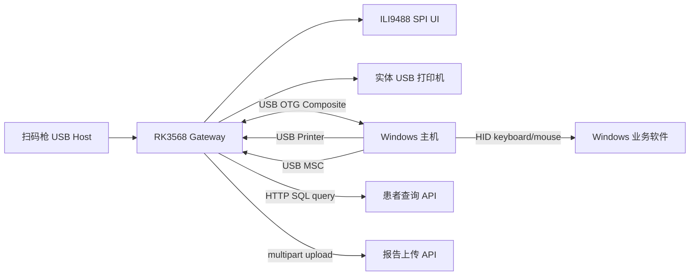

# AI 迁移手册：RK3568 USB Bridge v0.900

本文档供后续 AI 或工程师把当前项目移植到其他板子、其他检查设备或其他医院环境时使用。目标是让接手者先理解系统边界、硬件前提、关键状态机和不能随意改动的点。

版本: v0.900
生成日期: 2026-05-25
当前设备类型: `人体成分检查`
当前部署路径: `/opt/rk3568_gateway`
当前 Python 包名: `rk3588_gateway`

## 0. 最重要结论

1. 这是一个 USB Gadget 复合设备项目，不是普通上位机程序。
2. 当前板子作为 USB Device 连接 Windows 主机，同时作为 USB Host 连接扫码枪和实体打印机。
3. MSC 本地读取镜像必须解绑 UDC，会触发 Windows 重新枚举。
4. RK3568 vendor 4.19 的 HID/printer gadget 有内核 Oops 风险，不能随意增加对 `/dev/hidg0` 或 `/dev/g_printer0` 的读写方式。
5. 上传成功后才实体打印，这是当前业务要求。
6. 扫码 API 逻辑以 `exam_item` 为核心；新 SQL 必须返回每个检查项的单独记录。
7. 多条 API 记录时必须进入选择界面，不能自动录入。
8. SPI 屏不是 framebuffer 方案，而是用户态 ILI9488 spidev 方案。
9. 设备类型、ReportInfo.xml 放在 `/var/lib/rk3568-gateway/device`，这是设备身份目录。
10. 迁移前先确认目标板的 UDC、内核 gadget function、SPI、GPIO、Python 版本、CUPS 和接口网络。

## 1. 当前系统抽象

### 1.1 系统边界



### 1.2 当前复合 USB 功能

目标 Windows 主机应看到：

- HID Keyboard
- HID Mouse
- USB Printer
- USB Mass Storage

Linux 端设备节点：

- `/dev/hidg0`：HID keyboard
- `/dev/hidg1`：HID mouse
- `/dev/g_printer0`：USB printer gadget
- `/var/lib/rk3568-gateway/msc/ums_shared.img`：MSC backing image

## 2. 文件与模块地图

### 2.1 顶层文件

| 文件 | 作用 |
| --- | --- |
| `install_debian.sh` | Debian 10 安装脚本，安装 apt 依赖、venv、systemd 服务 |
| `config.example.yaml` | 默认配置模板 |
| `requirements.txt` | Python 依赖 |
| `pyproject.toml` | Python 包配置 |
| `MarkInfo_SearchTitle_Config_100.json` | HID 录入模板 |
| `VERSION` | 当前版本号 |

### 2.2 Python 模块

| 模块 | 作用 |
| --- | --- |
| `main.py` | 组装所有组件，启动 asyncio 服务 |
| `config.py` | 解析 YAML 配置 |
| `workflow.py` | 扫码、API、选择、HID 录入、UI 状态主流程 |
| `patient_api.py` | 构造 SQL、base64 POST、保存原始 JSON |
| `hid.py` | 读取扫码枪 evdev 事件 |
| `hid_output.py` | 输出 USB Gadget HID 键盘/鼠标 |
| `gpio.py` | GPIO 按键读取 |
| `msc_monitor.py` | 监听 MSC backing image、解绑 UDC、挂载镜像、复制新文件 |
| `print_capture.py` | 读取 `/dev/g_printer0` 并保存 PRN |
| `report_pdf.py` | 把 MSC/打印文件转换或复制为 PDF |
| `report_upload.py` | 监听 PDF、上传接口、成功后实体打印 |
| `printer.py` | 调用 CUPS `lp` |
| `api.py` | 本地 HTTP API 和 display state |
| `queue.py` | SQLite 事件队列 |
| `events.py` | 事件对象 |
| `display.py` | 浏览器显示 HTML |

### 2.3 脚本

| 脚本 | 作用 |
| --- | --- |
| `scripts/setup_usb_composite_gadget.sh` | 创建 RK3568 复合 USB gadget |
| `scripts/fb_status.py` | SPI ILI9488 UI |
| `scripts/find_input_devices.sh` | 查扫码枪输入设备 |
| `scripts/list_gpio_lines.sh` | 查 GPIO |
| `scripts/configure_gpio_buttons.py` | GPIO 辅助 |
| `scripts/smoke_test.sh` | 基础冒烟测试 |

## 3. 迁移前必须确认的问题

### 3.1 目标板基础信息

在目标板执行：

```bash
cat /proc/device-tree/model
uname -a
python3 --version
ls /sys/class/udc
lsusb
```

必须确认：

- 是否有 UDC。
- UDC 名称是什么。
- USB OTG 口是否接 Windows 主机。
- Python 是否兼容 3.7。
- 是否有 configfs。
- 是否支持 `usb_f_hid`、`usb_f_printer`、`usb_f_mass_storage`。

如果 `ls /sys/class/udc` 为空，USB gadget 无法工作。

### 3.2 目标板内核风险

当前 v0.900 主要绕过 RK3568 4.19 vendor 内核问题。如果换板或换内核，要确认以下调用是否安全：

- 对 `/dev/hidg0` 写 HID 报告。
- 对 `/dev/hidg0` 读取 LED 状态。
- 对 `/dev/g_printer0` 使用 `poll()`。
- UDC 解绑时是否有进程仍持有 `/dev/g_printer0` fd。
- MSC backing image 是否可在解绑后 loop mount。

不要在没有验证的情况下改成：

- 持续读取 `/dev/hidg0`
- UDC 解绑时保持 `/dev/g_printer0` poll
- 在 HID 录入过程中挂载 MSC 镜像

这些操作都可能触发旧内核 Oops。

### 3.3 SPI 屏确认

必须确认：

```bash
dmesg | grep -i -E "spi|ili|fbtft|spidev"
ls -l /dev/spidev*
cat /sys/kernel/debug/pinctrl/pinctrl-rockchip-pinctrl/pinmux-pins | grep spi
cat /sys/kernel/debug/gpio | grep -E "gpio-109|gpio-116|ili|fb|reset|dc"
```

当前板的经验：

- 内核显示 `fb_ili9486`，但实际屏是 ILI9488。
- 不能用 `/dev/fb0`。
- 需要 unbind `fb_ili9486` 后 bind `spidev`。
- 用户态 `fb_status.py --output ili9488` 可以点亮。

换板时要确认：

- SPI 总线号。
- DC GPIO。
- RESET GPIO。
- BL 是否 GPIO 控制或常亮。
- 旋转角度。
- RGB/BGR 顺序。
- 16bit/18bit pixel format。

### 3.4 GPIO 按键确认

当前按键：

- DOWN GPIO 138，active_low
- OK GPIO 139，active_low

换板时必须确认：

```bash
gpioinfo
cat /sys/kernel/debug/gpio
cat /sys/kernel/debug/pinctrl/pinctrl-rockchip-pinctrl/pinmux-pins
```

如果按键是按下接地：

```yaml
active_low: true
```

如果按下给高电平：

```yaml
active_low: false
```

## 4. 配置迁移步骤

### 4.1 复制项目

目标路径建议保持：

```bash
/opt/rk3568_gateway
```

如果换成其他板，仍建议保持路径不变，避免 systemd、模板路径、脚本路径全部联动修改。

### 4.2 修改配置

复制模板：

```bash
sudo cp /opt/rk3568_gateway/config.example.yaml /opt/rk3568_gateway/config.yaml
```

必须修改：

```yaml
device:
  id: "唯一设备编号"
  location: "设备位置"
  type: "目标检查项目"
  profile_dir: "/var/lib/rk3568-gateway/device"

patient_api:
  endpoint: "患者查询接口"

report_upload:
  endpoint: "报告上传接口"
  report_info_path: "/var/lib/rk3568-gateway/device/ReportInfo.xml"

hid_input:
  template_path: "/opt/rk3568_gateway/MarkInfo_SearchTitle_Config_100.json"
  screen_width: 1920
  screen_height: 1080

printer:
  printer_name: "CUPS队列名"

msc:
  udc_device: "目标板UDC名"

gpio:
  lines:
    - name: "down"
      number: 目标GPIO编号
    - name: "ok"
      number: 目标GPIO编号
```

### 4.3 设备身份目录

程序启动时会创建：

```bash
/var/lib/rk3568-gateway/device
```

这里必须放：

```bash
ReportInfo.xml
device_type.txt
```

`device_type.txt` 会自动写入 `config.yaml` 的 `device.type`。

`ReportInfo.xml` 需要人工按医院后台要求替换。

替换命令示例：

```bash
sudo cp /home/linaro/ReportInfo.xml /var/lib/rk3568-gateway/device/ReportInfo.xml
sudo chown root:root /var/lib/rk3568-gateway/device/ReportInfo.xml
```

## 5. API 迁移细节

### 5.1 查询接口必须支持 POST JSON

当前请求：

```json
{
  "sqlStr": "base64(sql)"
}
```

不要改成 GET。

### 5.2 SQL 字段要求

最少应返回：

- `exam_item`
- `his_exam_no`
- `report_no`
- `patient_id`
- `patient_name`
- `sex`
- `age`
- `birthday`
- `nian`
- `yue`
- `ri`
- `xing`
- `ming`

如果数据库字段名是 `exam_item_name`，建议 SQL 里 alias：

```sql
z.exam_item_name as exam_item
```

这样 workflow 逻辑最稳定。

### 5.3 多项目返回要求

推荐一个检查项一条记录：

```json
[
  {"exam_item":"动态心电图(含心率变异性分析)", "report_no":"..."},
  {"exam_item":"人体成分检查", "report_no":"..."},
  {"exam_item":"TCD检查", "report_no":"..."}
]
```

不推荐一个字段里塞多个项目：

```json
{"exam_item":"TCD检查,动态心电图(含心率变异性分析),人体成分检查"}
```

虽然当前程序会拆分，但一条记录拆成多项时 `report_no` 等字段可能不够精确。

### 5.4 API 调试方法

板子上看最新原始返回：

```bash
latest=$(ls -t /var/lib/rk3568-gateway/api_raw/api_*.json | head -n 1)
echo "$latest"
cat "$latest"
```

本地触发扫码：

```bash
curl -X POST http://127.0.0.1:8080/scan \
  -H 'Content-Type: application/json' \
  -d '{"code":"P2605220006"}'
```

查看 UI 状态：

```bash
curl http://127.0.0.1:8080/display/state
```

## 6. 选择逻辑迁移说明

### 6.1 当前 v0.900 规则

这是必须保持的业务规则：

1. 返回空：未找到申请单。
2. 返回 1 条且项目匹配：自动录入。
3. 返回 1 条且项目不匹配：显示不符，不录入。
4. 返回多条：显示所有项目，等待按键选择。
5. 多条中若有设备匹配项：默认光标在匹配项上。
6. 多条中若没有设备匹配项：默认光标在第一项上。
7. 用户可以选择其他非设备类型项目。

### 6.2 不要重新引入的旧逻辑

不要把多条结果过滤成只有匹配项：

```python
choice_items = [_record_item(records[index]) for index in matching_indices]
```

正确逻辑：

```python
choice_items = items
```

不要把用户选择映射回 `matching_indices`：

```python
index = matching_indices[choice % len(matching_indices)]
```

正确逻辑：

```python
index = choice % len(records)
```

## 7. HID 迁移说明

### 7.1 Windows 分辨率

如果目标 Windows 不是 1920x1080，必须改：

```yaml
hid_input:
  screen_width: 目标宽度
  screen_height: 目标高度
```

否则鼠标点击坐标会偏。

### 7.2 模板重录

模板文件是目标软件强绑定的：

```bash
MarkInfo_SearchTitle_Config_100.json
```

换 Windows 软件、换窗口大小、换 DPI、换检查设备录入界面，都必须重新生成或修改模板。

模板事件：

- `clickType=0`：只点击。
- `clickType=1`：点击后输入字段。
- `clickType=7`：条件点击，例如性别。

### 7.3 HID 稳定性约束

不要做以下改动：

- 不要长期持续读取 `/dev/hidg0`。
- 不要每个键盘报告都 open/close `/dev/hidg0`。
- 不要取消按键释放保护。
- 不要去掉 HID 写超时。
- 不要在 HID 录入中让 MSC 解绑 UDC。

原因：

- 已遇到 RK3568 4.19 `f_hidg_read` Oops。
- Windows 枚举期间 HID fd 可能失效。
- HID 输入卡住会导致 UI 长时间停在“正在录入”。

## 8. MSC 迁移说明

### 8.1 MSC 读取为什么要解绑 UDC

Linux 和 Windows 不能同时安全读写同一个 FAT image。当前做法是：

1. Windows 写入 U 盘。
2. 板子检测 image mtime 变化。
3. 等 Windows 写入停止。
4. 板子解绑 UDC。
5. 板子只读挂载 image。
6. 复制文件。
7. 卸载 image。
8. 重建 gadget。
9. Windows 重新枚举。

这是目前折中方案。

### 8.2 HID 期间延迟 MSC

规则：

- HID 自动录入中，即使 `ums_shared.img` mtime 变化，也不解绑 UDC。
- 等 HID 结束后下一轮处理同一个 mtime。

这一点不能删除。否则录入中 Windows USB 重枚举会打断 HID。

### 8.3 printer fd 保护

MSC 准备解绑前必须调用：

```python
print_capture.pause_for_gadget_unbind()
```

gadget 重建后必须调用：

```python
print_capture.resume_after_gadget_rebind()
```

这是为了避免 `/dev/g_printer0` poll 时 UDC 被解绑导致内核 crash。

### 8.4 MSC 去重

当前签名：

```text
相对文件名 + 文件大小 + sha256
```

优点：

- 同名同内容不会重复处理。
- 改名后即使内容相同也会重新处理，符合用户手工重复上传的使用习惯。

缺点：

- 大文件需要完整读取计算 sha256。

清空记忆：

```bash
sudo systemctl stop rk3568-gateway
sudo rm -f /var/lib/rk3568-gateway/msc_state/seen.db
sudo rm -f /var/lib/rk3568-gateway/msc_state/files.jsonl
sudo rm -f /var/lib/rk3568-gateway/msc_state/last_mtime
sudo systemctl restart rk3568-gateway
```

## 9. 虚拟打印迁移说明

### 9.1 Windows 驱动选择

虚拟打印的本质是 Windows 驱动生成一段打印数据，板子捕获为 `.prn`。如果 Windows 驱动输出不是良好的 PostScript，后续 `ps2pdf` 可能得到：

- 黑白 PDF
- 位图化 PDF
- 缺少文本层 PDF
- 后台解析失败的 PDF

因此：

- 需要后台按 PDF 内容解析时，优先使用 MSC 传原始 PDF。
- 虚拟打印可作为兼容入口，但不是所有 Windows 驱动都适合。

### 9.2 print_capture 状态机

`print_capture.py`：

1. open `/dev/g_printer0`
2. poll 读数据
3. 第一次读到数据时创建 `print_jobs/print_*.prn`
4. 持续写入
5. 超过 `idle_complete_seconds` 没有新数据后认为任务完成
6. 小于 `min_job_bytes` 丢弃
7. 转 PDF
8. 放入 `reports_pdf`
9. 由上传 worker 上传

### 9.3 不要恢复旧打印逻辑

不要在 `print_capture` 或 `msc_monitor` 中直接实体打印。当前业务要求是：

```text
PDF -> 上传成功 -> 实体打印
PDF -> 上传失败 -> 弹窗，不打印
```

所以 `main.py` 当前应把 `printer` 传给 `ReportUploadWorker`，而不是传给 `PrintCapture` 或 `MscMonitor`。

## 10. 上传迁移说明

### 10.1 上传接口

当前上传接口：

```text
POST http://192.168.112.139:9061/api/client/uploadOriginalReport
```

multipart 字段：

- `Report`: PDF 文件，`application/pdf`
- `ReportInfo`: XML 文件，`application/xml`

### 10.2 ReportInfo.xml

路径：

```bash
/var/lib/rk3568-gateway/device/ReportInfo.xml
```

换设备或换检查项目时，经常需要替换该 XML。

替换后不一定必须重启，但建议重启上传服务主程序避免人工误判：

```bash
sudo systemctl restart rk3568-gateway
```

### 10.3 上传成功后打印

当前逻辑：

```python
ok, error, response_text = self._upload(path)
if ok:
    printed = self._print_after_upload(path)
```

失败不会调用 `lp`。

### 10.4 失败不无限重试

当前 `_scan_once` 会跳过状态为：

```python
("uploaded", "baseline", "failed")
```

因此上传失败不会每隔一会重复上传和弹窗。这是 v0.900 的重要稳定点。

## 11. UI 迁移说明

### 11.1 SPI UI 数据

UI 只读：

```bash
http://127.0.0.1:8080/display/state
```

不要让 UI 直接操作业务状态，按键由主服务读取 GPIO。

### 11.2 UI 选择界面

`display.items` 是完整候选列表。

`display.selected_index` 是当前选中项。

屏幕只显示当前项开始的最多三项，DOWN 后列表滚动。

如果用户说“只有一个选项”，第一步不是改 UI，而是查：

```bash
curl http://127.0.0.1:8080/display/state
```

如果 JSON 里 `items` 只有一个，问题在 `workflow.py` 或 API 返回。

如果 JSON 里 `items` 多个但屏幕只有一个，问题在 `fb_status.py` 渲染。

## 12. 安装迁移清单

### 12.1 Debian 10 依赖

安装脚本依赖：

```bash
python3 python3-venv python3-pip python3-dev build-essential
cups cups-filters ghostscript printer-driver-hpcups hplip
libreoffice
rsync curl nano openssh-client sshpass dosfstools util-linux gpiod
fonts-wqy-microhei libjpeg-dev zlib1g-dev libfreetype6-dev
```

如果 Debian 10 源不可用，需要使用 `archive.debian.org`。不要在没有 Release 文件的镜像上强行 apt update。

### 12.2 Python 依赖

当前兼容 Python 3.7。不要使用 Python 3.10-only 语法。

核心依赖：

- `aiohttp`
- `PyYAML`
- `evdev`
- `Pillow`

### 12.3 安装命令

```bash
cd /home/linaro/rk3568_gateway
sudo bash install_debian.sh
```

安装后检查：

```bash
systemctl status rk3568-usb-gadget rk3568-gateway rk3568-fb-status --no-pager -l
curl http://127.0.0.1:8080/health
ls -l /dev/g_printer0 /dev/hidg0 /dev/hidg1 /dev/spidev1.0
```

## 13. 迁移到其他检查设备

### 13.1 需要改的地方

1. `config.yaml` 的 `device.type`
2. `/var/lib/rk3568-gateway/device/ReportInfo.xml`
3. HID 模板 `MarkInfo_SearchTitle_Config_100.json`
4. Windows 目标软件坐标和分辨率
5. 上传接口是否仍解析同一类 PDF
6. 实体打印机 CUPS 队列

### 13.2 不一定需要改的地方

如果仍然是 RK3568 + 同一块屏 + 同一 USB 架构，通常不改：

- USB gadget 脚本
- MSC 状态机
- print_capture 状态机
- report_upload 状态机
- GPIO 后端
- SPI UI 驱动

## 14. 迁移到其他板子

### 14.1 必须重做的硬件部分

1. UDC 名称。
2. USB OTG 口是否支持 device mode。
3. SPI 号和 pinctrl。
4. DC/RST/BL GPIO 编号和极性。
5. 按键 GPIO 编号和极性。
6. 扫码枪 USB Host 是否稳定。
7. 实体打印机 USB Host 是否稳定。

### 14.2 可能需要改的文件

| 变化 | 可能改动 |
| --- | --- |
| UDC 名称变 | `config.yaml msc.udc_device`、`setup_usb_composite_gadget.sh` 默认 UDC |
| 屏幕 SPI 号变 | `rk3568-fb-status.service --spidev` |
| DC/RST GPIO 变 | `rk3568-fb-status.service --dc-gpio --reset-gpio` |
| 屏幕方向变 | `rk3568-fb-status.service --rotate` |
| 按键 GPIO 变 | `config.yaml gpio.lines` |
| Python 版本变 | 检查 Python 3.7 兼容代码是否仍可用 |
| 发行版变 | 调整 `install_debian.sh` apt 包名 |
| CUPS 驱动变 | 重新创建 `printer.printer_name` |

### 14.3 UDC 验证

```bash
ls /sys/class/udc
modprobe libcomposite
mount -t configfs none /sys/kernel/config
```

如果缺少 gadget function：

```bash
modprobe usb_f_hid
modprobe usb_f_printer
modprobe usb_f_mass_storage
```

如果模块不存在，目标内核需要开启相关配置。

## 15. AI 修改代码时的硬约束

AI 后续改代码时必须遵守：

1. 修改前先看 `workflow.py`、`main.py`、`msc_monitor.py`、`print_capture.py`、`report_upload.py`。
2. 不要把上传失败改成无限重试。
3. 不要把上传前打印恢复回来。
4. 不要让多条 API 结果自动录入。
5. 不要过滤掉非设备类型项目，用户要求其他项目也可选择。
6. 不要在 HID 输入期间解绑 UDC。
7. 不要在 UDC 解绑时保持 `/dev/g_printer0` poll。
8. 不要持续读取 `/dev/hidg0`。
9. 不要假设 `/dev/fb0` 能驱动 ILI9488。
10. 不要把 Python 改成只支持 3.10+。
11. 不要改掉 `/var/lib/rk3568-gateway/api_raw` 原始响应保存。
12. 不要删除状态目录和日志记录，除非用户明确要求清除记忆。

## 16. 最小验证脚本

### 16.1 服务健康

```bash
systemctl status rk3568-usb-gadget rk3568-gateway rk3568-fb-status --no-pager -l
curl http://127.0.0.1:8080/health
```

### 16.2 API 和选择

```bash
curl -X POST http://127.0.0.1:8080/scan \
  -H 'Content-Type: application/json' \
  -d '{"code":"P2605220006"}'

sleep 2
curl http://127.0.0.1:8080/display/state
```

预期：

- 多条结果时 `screen=select_item`
- `display.items` 数量等于 API 可选项目数
- `selected_index` 默认指向设备类型匹配项

### 16.3 MSC

1. Windows 往 U 盘复制 PDF。
2. 板子看日志：

```bash
journalctl -u rk3568-gateway -f
```

预期：

- mtime 变化。
- host quiet。
- printer capture fd closed before gadget unbind。
- mounted image contains N visible files。
- msc new file copy。
- report pdf ready。
- report upload submitted 或 rejected。

### 16.4 虚拟打印

1. Windows 打印到 RK3568 Virtual Printer。
2. 检查：

```bash
ls -lh /var/lib/rk3568-gateway/print_jobs | tail
ls -lh /var/lib/rk3568-gateway/reports_pdf | tail
journalctl -u rk3568-gateway -n 120 --no-pager -l
```

预期：

- 出现 PRN。
- 出现 PDF。
- 上传 worker 处理 PDF。

### 16.5 上传

```bash
tail -n 30 /var/lib/rk3568-gateway/report_upload_state/uploads.jsonl
```

预期：

- 成功：`status=uploaded`，然后提交实体打印。
- 失败：`status=failed`，不打印，不反复弹窗。

## 17. 常见故障判断

### 17.1 UI 显示只有一个选项

先查：

```bash
curl http://127.0.0.1:8080/display/state
```

如果 `items` 只有一个：

- 看最新 API raw。
- 看 `workflow.py` 是否错误使用 `choice_items = matching_indices...`。

如果 `items` 多个：

- 查 `fb_status.py` 渲染逻辑。

### 17.2 API 明明有数据但显示未找到

查：

```bash
latest=$(ls -t /var/lib/rk3568-gateway/api_raw/api_*.json | head -n 1)
cat "$latest"
```

重点看：

- `code`
- `success`
- `data` 是否为空
- 是否有 `exam_item`
- SQL 是否查错字段
- 数据库是否 `exam_state='20'`
- `req_date` 是否在 180 天内

### 17.3 MSC 崩或 Windows U 盘异常

重点看：

```bash
dmesg | tail -n 120
journalctl -u rk3568-gateway -n 200 --no-pager -l
```

如果出现 `spinlock bad magic`、`printer_poll`、`f_hidg_read`：

- 不要继续加重读写。
- 优先检查 UDC 解绑前是否关闭了 print_capture fd。
- 检查是否有人恢复了 HID LED 连续读取。

### 17.4 上传成功但后台找不到

先看上传接口响应：

```bash
journalctl -u rk3568-gateway -n 300 --no-pager -l | grep -i "report upload"
```

如果接口返回 `SUCCESS` 但后台没有：

- 确认 `data.code` 是否为 `100`。
- 确认上传的 ReportInfo.xml 是目标患者/设备要求的版本。
- 确认后台是否按 PDF 内容解析，而非只看 XML。
- 对比 MSC 原始 PDF 和打印路径 PDF 的结构差异。

### 17.5 实体打印队列堆积

```bash
lpstat -t
lpq -P HP_DeskJet_4900
cancel -a HP_DeskJet_4900
```

打印机拔下期间可能积攒 CUPS 队列，恢复后可能集中打印。

## 18. 推荐版本化流程

本项目每个稳定版本建议执行：

```bash
git status --short
git add <确认属于本版本的文件>
git commit -m "Release vX.YYY"
git tag -a vX.YYY -m "Release vX.YYY"
git push origin main
git push origin vX.YYY
```

部署到板子前建议打包：

```bash
tar --exclude .git --exclude .venv -czf rk3568_gateway_vX.YYY.tar.gz rk3588_gateway
```

板子上安装后保存现场：

```bash
sudo tar -czf /home/linaro/rk3568_gateway_working_vX.YYY.tar.gz \
  /opt/rk3568_gateway \
  /etc/systemd/system/rk3568-gateway.service \
  /etc/systemd/system/rk3568-usb-gadget.service \
  /etc/systemd/system/rk3568-fb-status.service
```

## 19. 当前 v0.900 的移植优先级

如果只换检查设备，不换板：

1. 改 `device.type`
2. 换 `ReportInfo.xml`
3. 换 HID 模板
4. 测 API 返回
5. 测 HID 录入
6. 测 MSC 原始 PDF 上传
7. 测上传成功后实体打印

如果换板：

1. 先点亮 USB gadget。
2. 再点亮 SPI UI。
3. 再接扫码枪。
4. 再接实体打印机。
5. 再部署业务代码。
6. 最后测试 MSC/虚拟打印/上传/HID 全链路。

## 20. 给后续 AI 的一句话任务理解

这是一个部署在 RK3568 Debian 10 上的 USB composite gateway：扫码查询患者，按检查项目选择，通过 USB HID 在 Windows 软件中录入；Windows 通过 MSC 或虚拟打印把报告交给板子，板子保存/转 PDF，上传服务器，上传成功后再实体打印；SPI ILI9488 显示状态。移植时必须优先保护 USB gadget 状态机，尤其是 HID 录入期间不解绑 UDC、MSC 解绑前先停 print_capture、不要持续读 `/dev/hidg0`。
