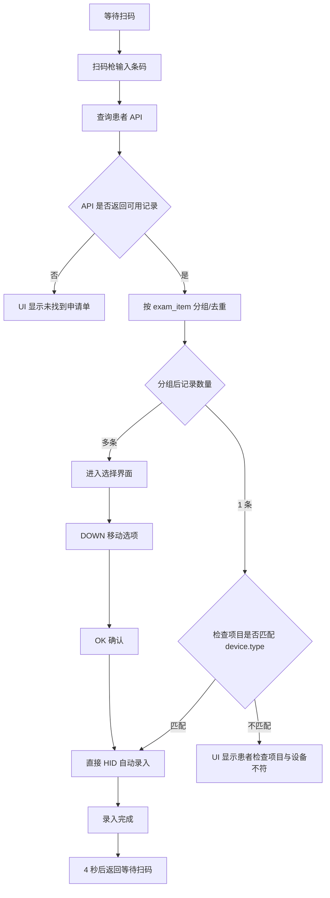
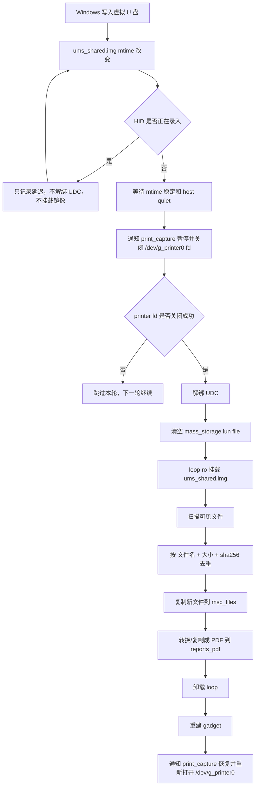
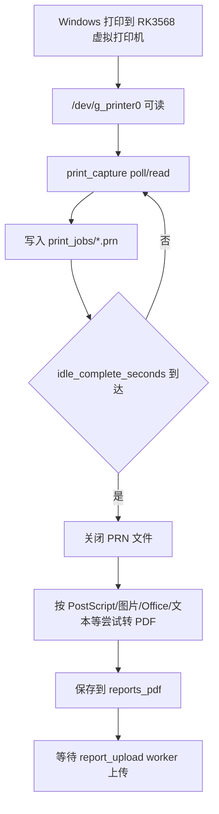

# RK3568 USB Bridge v0.900 技术报告

版本: v0.900
生成日期: 2026-05-25
项目目录: `/opt/rk3568_gateway`
数据目录: `/var/lib/rk3568-gateway`
本地仓库目录: `D:\Documents\New project\rk3588_gateway`

## 1. 项目目标

本项目把 RK3568 Debian 10 板子做成一台复合 USB 中转设备，用来连接 Windows 主机、扫码枪、SPI 小屏、实体打印机和医院业务接口。当前 v0.900 的核心目标是：

1. Windows 主机通过 USB OTG 看到 RK3568 复合设备。
2. 复合设备同时提供 HID 键盘、HID 鼠标、USB 虚拟打印机、USB Mass Storage U 盘。
3. 扫码枪接在 RK3568 USB Host 上，由板子读取条码。
4. 扫码后查询业务 API，按检查项目选择或自动录入。
5. 通过 HID 键盘/鼠标在 Windows 软件中自动录入患者信息。
6. Windows 可以通过虚拟 U 盘或虚拟打印机把报告交给 RK3568。
7. RK3568 把报告统一整理成 PDF，自动上传接口。
8. 只有上传成功后才提交实体打印；上传失败只弹窗，不打印。
9. SPI ILI9488 屏显示主流程状态和报告接收/上传弹窗。
10. 尽量规避 RK3568 vendor 4.19 USB gadget 内核 BUG。

## 2. 目标硬件与系统

### 2.1 当前已验证硬件

| 项目 | 当前值 |
| --- | --- |
| 板子 | Rockchip RK3568 ATK EVB1 DDR4 V10 |
| 系统 | Debian GNU/Linux 10 |
| 内核 | Linux 4.19.232 |
| 架构 | aarch64 |
| USB Device Controller | `fcc00000.dwc3` |
| Python | 3.7.3 |
| 应用目录 | `/opt/rk3568_gateway` |
| 数据目录 | `/var/lib/rk3568-gateway` |
| 本地 API | `0.0.0.0:8080` |
| 板子 SSH | `linaro@192.168.20.250` |

### 2.2 SPI 屏

| 屏幕引脚 | RK3568 板端 |
| --- | --- |
| VCC | 3.3V |
| GND | GND |
| SCL/CLK | `SPI1_CLK_M1` |
| SDA/MOSI/DIN | `SPI1_MOSI_M1` |
| CS | `SPI1_CS0_M1` |
| DC/RS | `GPIO3_C4` / Linux GPIO 116 |
| RES/RST | `GPIO3_B5` / Linux GPIO 109 |
| BL/LED | 3.3V 常亮 |

重要结论：

- 板子内核默认把 `spi1.0` 绑定到 `fb_ili9486`，但是当前屏幕实际是 ILI9488。
- `fb_ili9486` 下写 `/dev/fb0` 无显示，最终采用用户态 ILI9488 SPI 直刷。
- systemd 启动屏幕服务前会执行：
  - unbind `fb_ili9486`
  - 设置 `driver_override=spidev`
  - bind `spidev`
  - 使用 `/dev/spidev1.0` 输出 UI
- 当前屏幕服务使用 `--rotate 270`，相当于永久旋转到实际横屏方向。

### 2.3 GPIO 按键

| 功能 | RK 引脚 | Linux GPIO | 逻辑 |
| --- | --- | --- | --- |
| DOWN | `GPIO4_B2` | 138 | 按下接地，active_low |
| OK | `GPIO4_B3` | 139 | 按下接地，active_low |

程序中按键通过 sysfs GPIO 读取：

- DOWN 只在选择界面移动选中项。
- OK 只在选择界面确认当前选中项。

## 3. 运行组件

### 3.1 systemd 服务

当前 RK3568 使用三个主要服务。

#### `rk3568-usb-gadget.service`

文件: `systemd/rk3568-usb-gadget.service`

作用：

- 启动时执行 `/opt/rk3568_gateway/scripts/setup_usb_composite_gadget.sh`
- 创建 USB composite gadget
- 生成 `/dev/g_printer0`
- 生成 `/dev/hidg0`
- 生成 `/dev/hidg1`
- 绑定 Mass Storage backing image

服务类型：

- `Type=oneshot`
- `RemainAfterExit=yes`
- 在 `rk3568-gateway.service` 之前启动

#### `rk3568-gateway.service`

文件: `systemd/rk3568-gateway.service`

作用：

- 启动主业务程序
- 工作目录 `/opt/rk3568_gateway`
- 设置 `PYTHONPATH=/opt/rk3568_gateway/src`
- 执行：

```bash
/opt/rk3568_gateway/.venv/bin/python -m rk3588_gateway.main --config /opt/rk3568_gateway/config.yaml
```

说明：

- Python 包名仍为 `rk3588_gateway`，目录名改为 `rk3568_gateway`。
- 这是迁移遗留命名，不影响运行。

#### `rk3568-fb-status.service`

文件: `systemd/rk3568-fb-status.service`

作用：

- 将 SPI1 从内核 `fb_ili9486` 释放出来。
- 改成 `spidev`。
- 启动 `scripts/fb_status.py` 直接驱动 ILI9488。

当前关键启动参数：

```bash
--output ili9488
--spidev /dev/spidev1.0
--dc-gpio 116
--reset-gpio 109
--bl-gpio -1
--width 480
--height 320
--rotate 270
--spi-speed 16000000
--color-order rgb
--pixel-format 18
--invert off
--interval 0.2
```

## 4. USB Gadget 架构

### 4.1 复合设备组成

脚本: `scripts/setup_usb_composite_gadget.sh`

复合设备信息：

| 字段 | 当前值 |
| --- | --- |
| idVendor | `0x2207` |
| idProduct | `0x3568` |
| manufacturer | `RK3568` |
| product | `RK3568 HID Printer MSC Bridge` |
| serialnumber | `RK3568BRIDGE001` |
| configuration | `Printer + MSC + HID Keyboard + HID Mouse` |
| UDC | `fcc00000.dwc3` |

功能顺序：

1. `printer.usb0` -> `/dev/g_printer0`
2. `mass_storage.0` -> Windows U 盘
3. `hid.usb0` -> `/dev/hidg0` 键盘
4. `hid.usb1` -> `/dev/hidg1` 鼠标

### 4.2 Mass Storage backing image

当前镜像：

```bash
/var/lib/rk3568-gateway/msc/ums_shared.img
```

默认大小：

```bash
64 MiB
```

默认卷标：

```bash
RK3568MSC
```

第一次不存在时，脚本会：

```bash
dd if=/dev/zero of="$MSC_IMAGE" bs=1M count="$MSC_SIZE_MB"
mkfs.vfat -n "$MSC_LABEL" "$MSC_IMAGE"
```

## 5. 配置文件

主配置路径：

```bash
/opt/rk3568_gateway/config.yaml
```

模板文件：

```bash
config.example.yaml
```

### 5.1 设备配置

```yaml
device:
  id: "rk3568-atk-evb1-001"
  location: "workbench"
  type: "人体成分检查"
  profile_dir: "/var/lib/rk3568-gateway/device"
```

说明：

- `device.type` 是本设备负责的检查项目。
- v0.900 当前设备类型为 `人体成分检查`。
- 程序启动时会把设备类型写入：

```bash
/var/lib/rk3568-gateway/device/device_type.txt
```

### 5.2 API 查询配置

```yaml
patient_api:
  enabled: true
  endpoint: "http://192.168.112.139:9061/api/client/getTJPatientInfo"
  timeout_seconds: 10
  user_agent: "RK3568-Gateway"
  raw_dir: "/var/lib/rk3568-gateway/api_raw"
```

每次查询返回的原始 JSON 会保存到：

```bash
/var/lib/rk3568-gateway/api_raw/api_YYYYmmdd_HHMMSS_micro_200_SCAN.json
```

这是排查“API 返回了什么”和“UI 为什么这样判断”的第一证据。

### 5.3 HID 配置

```yaml
hid_input:
  enabled: true
  keyboard_backend: "usb_gadget"
  mouse_backend: "usb_gadget"
  keyboard_device: "/dev/hidg0"
  mouse_device: "/dev/hidg1"
  template_path: "/opt/rk3568_gateway/MarkInfo_SearchTitle_Config_100.json"
  screen_width: 1920
  screen_height: 1080
  action_delay_ms: 150
  start_delay_ms: 150
  force_caps_ascii: true
  non_ascii_mode: "powershell"
  powershell_wait_ms: 1800
```

说明：

- 当前不再使用 CH9350 串口转 USB 模块。
- 键盘走 `/dev/hidg0`。
- 鼠标走 `/dev/hidg1`。
- 目标 Windows 分辨率按 1920x1080 计算绝对鼠标坐标。
- 非 ASCII 文本通过 Windows PowerShell 设置剪贴板后粘贴。

### 5.4 报告上传配置

```yaml
report_upload:
  enabled: true
  endpoint: "http://192.168.112.139:9061/api/client/uploadOriginalReport"
  report_info_path: "/var/lib/rk3568-gateway/device/ReportInfo.xml"
  state_dir: "/var/lib/rk3568-gateway/report_upload_state"
  poll_interval_seconds: 5
  timeout_seconds: 30
  retry_interval_seconds: 60
  max_attempts: 3
  init_baseline: true
```

上传时提交 multipart：

```bash
curl -v \
  "http://192.168.112.139:9061/api/client/uploadOriginalReport" \
  -F "Report=@/var/lib/rk3568-gateway/reports_pdf/example.pdf;type=application/pdf" \
  -F "ReportInfo=@/var/lib/rk3568-gateway/device/ReportInfo.xml;type=application/xml"
```

注意：

- 当前 ReportInfo 已移到设备目录下。
- 旧路径 `/var/lib/rk3568-gateway/ReportInfo.xml` 如果存在，程序启动时会自动复制到新路径。
- 上传状态写入：

```bash
/var/lib/rk3568-gateway/report_upload_state/uploads.jsonl
```

## 6. API 查询逻辑

### 6.1 SQL

当前 SQL 由 `patient_api.py` 生成，重点是使用：

```sql
z.exam_item_name as exam_item
```

完整结构：

```sql
select
  z.exam_item_name as exam_item,
  t.his_exam_no,
  z.report_no,
  t.patient_id,
  t.patient_name,
  q.name_phonetic,
  substr(t.patient_name, 0, 2) as xing,
  substr(t.patient_name, 2, 8) as ming,
  t.sex,
  t.age,
  to_char(t.birthday,'yyyy') as nian,
  to_char(t.birthday,'mm') as yue,
  to_char(t.birthday,'dd') as ri,
  t.birthday
from exam_master t
left join exam_item z on t.his_exam_no=z.his_exam_no
left join patient_info q on t.patient_id=q.patient_id
where
  (
    z.report_no like '%{scan}%'
    or t.patient_id like '%{scan}%'
    or t.patient_name like '%{scan}%'
  )
  and z.exam_state='20'
  and req_date>= CURRENT_DATE - INTERVAL '180 days'
order by t.req_date desc
limit 20
```

### 6.2 请求格式

接口不是普通 GET。必须 POST JSON，字段为 base64 后的 SQL：

```json
{
  "sqlStr": "base64(sql)"
}
```

HTTP 头：

```http
Content-Type: application/json;charset=UTF-8
Accept: application/json
User-Agent: RK3568-Gateway
```

### 6.3 返回解析

程序接受以下结构：

1. `{ "data": [ {...}, {...} ] }`
2. `{ "data": {...} }`
3. 顶层就是一个患者对象。
4. 顶层就是数组。

字段归一化：

- 程序优先使用 `exam_item`。
- 如果没有 `exam_item`，尝试 `exam_item_name`、`examItemName`、`examItem`。
- 新 SQL 已经把 `z.exam_item_name` alias 成 `exam_item`，这是当前推荐方式。

### 6.4 API 原始结果保存

每次 API 调用，不管后续选择逻辑如何，原始 JSON 都保存到：

```bash
/var/lib/rk3568-gateway/api_raw/
```

排查命令：

```bash
latest=$(ls -t /var/lib/rk3568-gateway/api_raw/api_*.json | head -n 1)
echo "$latest"
cat "$latest"
```

## 7. 扫码与选择逻辑

实现文件：

```text
src/rk3588_gateway/workflow.py
```

### 7.1 主流程



### 7.2 v0.900 当前选择规则

1. API 返回空、不可解析、网络错误、超时：
   - UI 显示未找到申请单。
   - 产生事件 `patient.query_failed`。

2. API 返回 1 条记录：
   - 如果 `exam_item` 与 `device.type` 匹配，直接自动录入。
   - 如果不匹配，显示患者检查项目与设备不符，不录入。

3. API 返回多条记录：
   - 不自动录入。
   - UI 显示所有记录，不只显示匹配设备类型的记录。
   - 如果存在和 `device.type` 匹配的项目，默认光标停在第一个匹配项目。
   - 如果没有匹配项，默认光标停在第一个项目。
   - DOWN 循环移动。
   - OK 确认当前项目。
   - 允许选择不符合设备类型的其他项目，这是当前 v0.900 行为。

### 7.3 检查项目匹配

匹配函数会去掉字符串中的所有空白后比较：

```python
candidate == target or target in candidate
```

示例：

- `device.type = 人体成分检查`
- `exam_item = 人体成分检查` -> 匹配
- `exam_item = 人体成分检查 ` -> 匹配
- `exam_item = 宽频声导抗,人体成分检查` -> 如果经过旧数据拆分后也可匹配

### 7.4 旧 SQL 与新 SQL 的差异

旧 SQL 使用 `t.exam_item`，一个返回记录里可能包含多个项目字符串，例如：

```json
"exam_item": "TCD检查,动态心电图(含心率变异性分析),人体成分检查"
```

新 SQL 使用 `z.exam_item_name as exam_item`，每个报告号/检查项单独返回，例如：

```json
[
  {"exam_item": "动态心电图(含心率变异性分析)", "...": "..."},
  {"exam_item": "人体成分检查", "...": "..."},
  {"exam_item": "TCD检查", "...": "..."}
]
```

当前 v0.900 以新 SQL 为准。旧 SQL 返回逗号组合项目时，程序仍会尝试按分隔符拆开。

## 8. HID 自动录入逻辑

### 8.1 模板文件

当前模板：

```bash
/opt/rk3568_gateway/MarkInfo_SearchTitle_Config_100.json
```

模板结构：

- `title`
- `windowTitleLocation`
- `eventClassList`

事件类型：

| clickType | 含义 |
| --- | --- |
| 0 | 鼠标点击 |
| 1 | 点击并输入字段 |
| 7 | 条件单选，当前用于性别等条件判断 |

### 8.2 字段来源

`form.py` 会把患者记录转换成 HID 录入任务。模板中 `text` 字段对应患者字段，例如：

- `patient_id`
- `patient_name`
- `age`
- `birthday`
- `sex`
- `xing`
- `ming`
- `nian`
- `yue`
- `ri`

### 8.3 HID 键盘

当前使用 USB Gadget HID：

```bash
/dev/hidg0
```

写入标准 8 字节键盘报告：

```text
modifier, reserved, key1, key2, key3, key4, key5, key6
```

当前重要保护：

- 键盘 fd 尽量复用。
- 写入有超时。
- 按键按下后一定释放。
- USB gadget 模式下不连续读取 `/dev/hidg0` LED，避免 RK3568 vendor 4.19 的 `f_hidg_read` 内核 Oops。

### 8.4 HID 鼠标

当前使用：

```bash
/dev/hidg1
```

鼠标报告 5 字节：

```text
button, x_low, x_high, y_low, y_high
```

Windows 主机分辨率以配置中的 `screen_width=1920`、`screen_height=1080` 映射到 HID 绝对坐标 0-32767。

### 8.5 中文和非 ASCII 文本

ASCII 字段直接用 HID 键盘输入。

非 ASCII 字段使用 Windows PowerShell 剪贴板：

1. HID 发送 Win+R。
2. 输入隐藏 PowerShell 命令。
3. PowerShell 调用 `Set-Clipboard`。
4. 点击目标输入框。
5. Ctrl+V 粘贴。

风险点：

- Windows 剪贴板被安全策略禁用时会失败。
- PowerShell 执行慢时需要增大 `powershell_wait_ms`。
- Windows 焦点不在目标软件时会录入到错误窗口。

## 9. 报告接收逻辑

### 9.1 报告来源

当前有两个入口：

1. MSC 虚拟 U 盘
2. USB 虚拟打印机

二者最终都会生成 PDF 到同一个目录：

```bash
/var/lib/rk3568-gateway/reports_pdf
```

上传 worker 只监听这个目录。

### 9.2 MSC 虚拟 U 盘流程



### 9.3 MSC 去重规则

当前签名：

```text
相对路径文件名 | 文件大小 | sha256
```

代码中为：

```python
signature = f"{rel}|{stat.st_size}|{sha256}"
```

状态文件：

```bash
/var/lib/rk3568-gateway/msc_state/seen.db
/var/lib/rk3568-gateway/msc_state/files.jsonl
/var/lib/rk3568-gateway/msc_state/last_mtime
```

清除 MSC 重复记忆：

```bash
sudo systemctl stop rk3568-gateway
sudo rm -f /var/lib/rk3568-gateway/msc_state/seen.db
sudo rm -f /var/lib/rk3568-gateway/msc_state/files.jsonl
sudo rm -f /var/lib/rk3568-gateway/msc_state/last_mtime
sudo systemctl restart rk3568-gateway
```

注意：

- 文件改名但内容相同，因为相对文件名不同，仍会被视为新文件。
- 同名同大小同内容不会重复处理。
- sha256 是全文件内容哈希，会读取完整文件。

### 9.4 虚拟打印机流程



当前虚拟打印注意点：

- Windows 端建议选择能输出 PostScript/PDF 友好的驱动。
- Windows 不同虚拟打印驱动会影响 RK3568 生成 PDF 的质量。
- 经过打印路径得到的 PDF 可能和原始 PDF 不一致，后台解析可能失败。
- 如果后台解析依赖原始 PDF 文本结构，MSC 直接传原始 PDF 比虚拟打印更可靠。

### 9.5 ReportPdf 转换策略

实现文件：

```text
src/rk3588_gateway/report_pdf.py
```

转换顺序：

1. 如果源文件本身是 PDF：直接复制。
2. 如果是 PostScript：使用 `ps2pdf` 转换。
3. 如果是图片：Pillow 保存为 PDF。
4. 如果是 Office 文档：LibreOffice headless 转 PDF。
5. 如果是文本：用 Pillow 绘制文本页生成 PDF。
6. 都失败：生成占位 PDF，说明无法转换。

占位 PDF 不应被视为有效报告。上传失败后会记录为失败，不会实体打印。

## 10. 上传与实体打印逻辑

### 10.1 上传 worker

实现文件：

```text
src/rk3588_gateway/report_upload.py
```

监听目录：

```bash
/var/lib/rk3568-gateway/reports_pdf
```

每个 PDF 的上传签名：

```text
文件名 | 文件大小 | sha256
```

状态文件：

```bash
/var/lib/rk3568-gateway/report_upload_state/uploads.jsonl
```

### 10.2 上传成功判定

HTTP 2xx 只是必要条件，不是充分条件。

程序会解析 JSON：

失败条件：

- `success` 为 `false`
- `code` 为 `FAIL`、`FAILED`、`ERROR`
- `code` 存在但不是 `SUCCESS`
- `data.code` 存在且不是 `100`

成功条件：

- `success=true`
- 或 `code=SUCCESS`
- 且没有上面的失败条件

### 10.3 上传后打印

v0.900 重要规则：

- 上传成功后，才调用实体打印机。
- 上传失败，不打印。
- 上传失败会弹窗 2 秒。
- 上传失败的文件写入 `uploads.jsonl`，状态为 `failed`，后续不会无限重试。

实体打印调用：

```bash
lp -d HP_DeskJet_4900 -t "uploaded report" /path/to/report.pdf
```

当前 CUPS 队列：

```bash
HP_DeskJet_4900
```

已验证设备 URI 类似：

```text
usb://HP/DeskJet%204900%20series?serial=CN4CDGZ1JD&interface=1
```

## 11. UI 显示逻辑

实现文件：

```text
scripts/fb_status.py
```

数据来源：

```bash
http://127.0.0.1:8080/display/state
```

主界面状态：

| screen | 含义 |
| --- | --- |
| `wait_scan` | 等待扫码 |
| `querying` | 正在查询 API |
| `not_found` | 未找到申请单 |
| `select_item` | 多项目选择 |
| `inputting` | 正在 HID 自动录入 |
| `upload_done` | 录入完成，4 秒后返回等待扫码 |
| `exam_mismatch` | 检查项目与设备不符 |

报告入口弹窗：

- MSC 接收文件：弹窗 2 秒。
- 虚拟打印接收文件：弹窗 2 秒。
- 上传成功：弹窗 2 秒。
- 上传失败：弹窗 2 秒。

主流程和弹窗是分离的：

- 扫码/HID 是主流程。
- MSC/模拟打印/上传提示是覆盖弹窗，不改变主流程状态。

## 12. 本地 API

服务地址：

```bash
http://127.0.0.1:8080
```

常用接口：

```bash
curl http://127.0.0.1:8080/health
curl http://127.0.0.1:8080/display/state
curl http://127.0.0.1:8080/events?limit=20
curl http://127.0.0.1:8080/gpio
curl -X POST http://127.0.0.1:8080/scan -H 'Content-Type: application/json' -d '{"code":"P2605220006"}'
```

说明：

- `/scan` 当前只启动扫码流程，不等待流程完成。
- 这样可以避免 API 请求被 HID 自动录入过程阻塞。

## 13. 关键数据目录

| 路径 | 用途 |
| --- | --- |
| `/opt/rk3568_gateway` | 应用安装目录 |
| `/opt/rk3568_gateway/config.yaml` | 主配置 |
| `/opt/rk3568_gateway/MarkInfo_SearchTitle_Config_100.json` | HID 录入模板 |
| `/var/lib/rk3568-gateway/events.db` | 事件 SQLite |
| `/var/lib/rk3568-gateway/api_raw` | API 原始响应 |
| `/var/lib/rk3568-gateway/device` | 当前设备资料，含 `device_type.txt` 和 `ReportInfo.xml` |
| `/var/lib/rk3568-gateway/msc/ums_shared.img` | MSC U 盘镜像 |
| `/var/lib/rk3568-gateway/msc_files` | MSC 复制出的原始文件 |
| `/var/lib/rk3568-gateway/msc_state` | MSC 去重/mtime 状态 |
| `/var/lib/rk3568-gateway/print_jobs` | 虚拟打印捕获 PRN |
| `/var/lib/rk3568-gateway/reports_pdf` | 统一 PDF 输出和上传监听目录 |
| `/var/lib/rk3568-gateway/report_upload_state/uploads.jsonl` | 上传记录 |

## 14. 运行与排障命令

### 14.1 服务状态

```bash
systemctl status rk3568-usb-gadget rk3568-gateway rk3568-fb-status --no-pager -l
```

### 14.2 实时日志

```bash
journalctl -u rk3568-gateway -f
journalctl -u rk3568-usb-gadget -f
journalctl -u rk3568-fb-status -f
```

### 14.3 USB 设备节点

```bash
ls -l /dev/g_printer0 /dev/hidg0 /dev/hidg1 /dev/spidev1.0
ls /sys/class/udc
```

### 14.4 屏幕测试

```bash
systemctl status rk3568-fb-status --no-pager -l
cat /sys/bus/spi/devices/spi1.0/driver_override
ls -l /dev/spidev1.0
```

### 14.5 打印机

```bash
lpstat -t
lpoptions -p HP_DeskJet_4900 -l
lp -d HP_DeskJet_4900 /var/lib/rk3568-gateway/reports_pdf/example.pdf
```

### 14.6 上传记录

```bash
tail -n 50 /var/lib/rk3568-gateway/report_upload_state/uploads.jsonl
journalctl -u rk3568-gateway -n 200 --no-pager -l | grep -i "report upload"
```

## 15. 已知风险与设计约束

### 15.1 RK3568 vendor 4.19 USB gadget 内核风险

已遇到过的崩溃方向：

- `f_hidg_read`
- `printer_poll`
- `usb_ep_queue`
- `spinlock bad magic`
- `Internal error: Oops: 96000004`

当前规避策略：

1. USB gadget 键盘不做连续 LED 读取。
2. MSC 要解绑 UDC 前，先通知 `print_capture` 停止 poll。
3. 等 `/dev/g_printer0` fd 关闭后再解绑 UDC。
4. gadget 重建后，再让 `print_capture` 重新打开 `/dev/g_printer0`。
5. HID 录入期间，MSC 检测到镜像 mtime 变化也不解绑、不挂载，等 HID 录入结束后再处理。

### 15.2 Windows 重新枚举影响

每次 MSC 本地读取镜像时，程序需要解绑 UDC，这会导致 Windows 端看到 USB 复合设备断开并重新枚举。影响：

- Windows U 盘可能弹出/重现。
- 虚拟打印机可能短暂断开。
- Windows 打印队列可能显示未知/错误状态。

当前通过 `print_capture.pause_for_gadget_unbind()` 缓解板子侧 fd 问题，但无法完全消除 Windows 枚举行为。

### 15.3 打印路径与后台 PDF 解析

后台上传接口会解析 PDF 内容。实测：

- 原始 PDF 通过 MSC 直接上传，解析成功率高。
- 同一份报告通过 Windows 打印再转 PDF，内容结构可能改变，后台解析可能失败。

因此：

- 需要后台解析时，优先推荐 MSC 上传原始 PDF。
- 虚拟打印入口可用，但驱动选择影响非常大。

## 16. v0.900 验收点

v0.900 应满足：

1. 三个 systemd 服务可开机自启。
2. Windows 能识别复合 USB 设备。
3. `/dev/g_printer0`、`/dev/hidg0`、`/dev/hidg1` 存在。
4. `/dev/spidev1.0` 存在，SPI 屏有 UI。
5. 扫码后 API 原始响应保存到 `api_raw`。
6. 返回空时 UI 显示未找到申请单。
7. 返回单条且匹配设备类型时自动录入。
8. 返回多条时显示所有项目并等待 OK 确认。
9. HID 自动录入期间，MSC 不解绑 UDC。
10. MSC 放入 PDF 后复制到 `msc_files`，再出现在 `reports_pdf`。
11. 虚拟打印任务能保存到 `print_jobs` 并转成 PDF。
12. `reports_pdf` 新 PDF 能触发上传。
13. 上传成功才实体打印。
14. 上传失败不实体打印、不无限重试。

## 17. 建议后续版本

v0.900 是功能闭环版本，不是长期稳定版本。建议后续版本：

1. 增加明确版本号接口，例如 `/version`。
2. 将当前 Python 包名从 `rk3588_gateway` 重命名为 `rk3568_gateway`。
3. 修正历史中文字符串编码问题，统一 UTF-8。
4. 增加单元测试覆盖 API 分组选择逻辑。
5. 增加 USB gadget 操作的状态机日志。
6. 增加 ReportInfo.xml 热替换校验。
7. 对上传失败增加人工重试命令，而不是自动重试。
8. 评估升级内核或换稳定 USB gadget 补丁，降低 4.19 vendor 内核 Oops 风险。
